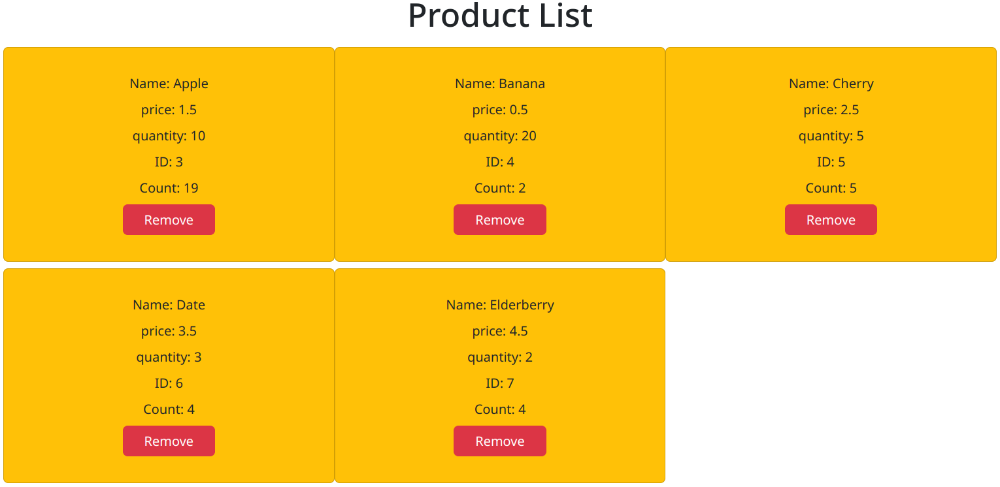
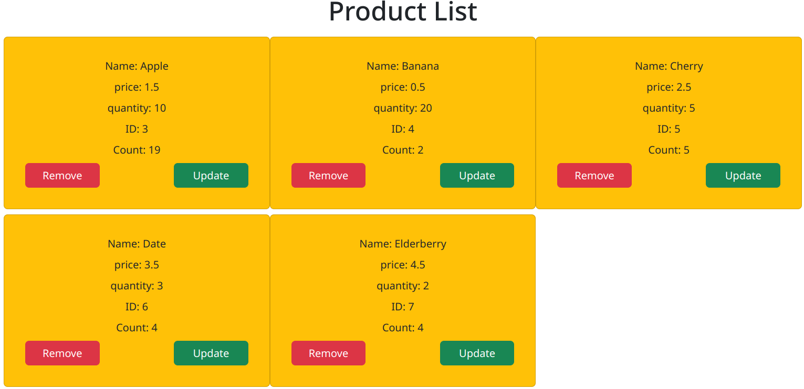

To know the structure of any react project always look at the `App.jsx` file as it is the main component of the project.

- Each child should have a unique key props error
- This error appears when you have an array and you are mapping a jsx element for each element in the array.
- If the function will change any state, it's better to be declared beside the state declaration, so the function and the state have the same scope.
- `new` keyword only with either constructor functions or classes.

<!--

const newCopy = new products // will not work
const newCopy = products // shallow copy
structuredClone // deep copy

-->

- It's better to take a copy of the object or array before changing it.

If you have an array of objects each with it's own `id` displayed in the page, and you want to add a button to remove an item from the array, you have two options:

1. Pass the index of the item to the function that will remove it.
2. Use `filter` to remove the item from the array.

**What if you want to update a property in an object in that array?**

1. We can use the index again to access that object and update it.
2. We can pass the whole object to the update function and get its index via `indexOf` function then take a copy of the original array, update the object in the copy, and set the state with the updated array.

We shouldn't change any state directly, we should always take a copy of the state and change the copy.

<!-- 
`indexOf` function uses strict equality so it won't work with objects unless they have the same reference in memory, if not it will return -1 even if the objects have the exact same properties and values.
-->

# Example

In this example we have an array of objects and we want to remove an object from the array, update a property in an object in the array:

```{.jsx .numberLines}
import { useState } from "react";
import ShowArr from "../ShowArr/ShowArr";

export default function Array() {
  const [products, setProducts] = useState([
    {
      name: "Apple",
      price: 1.5,
      quantity: 10,
      count: 19,
      id: 3,
    },
    {
      name: "Banana",
      price: 0.5,
      quantity: 20,
      count: 2,
      id: 4,
    },
    // ...
  ]);

  return (
    <div className="container-fluid">
      <h1>Product List</h1>
      <div className="row">
        {products.map((product, i) => (
          <ShowArr
            product={product}
            key={i}
            id={i}
          />
        ))}
      </div>
    </div>
  );
}
```

The `Array` component is the parent component of `ShowArr` component, and it has an array of objects `products` that will be displayed in the page.

The code above returns a bootstrap fluid container with a header and a row that contains the `ShowArr` component for each object in the `products` array.

To call the `ShowArr` component with each object in the `products` array, we use the `map` function to loop through the array and return the `ShowArr` component with the object as a prop.

We also have the second parameter in the map function `i` which is the index of the current object in the array, and we pass it as a prop to the `ShowArr` component twice, as `key` which is a unique identifier for each element in the array required by react (you will get a warning if you don't pass it but the code will still work), and as `id` which is the `id` of the object.

And in the `ShowArr` component we have the following code:

```{.jsx .numberLines}
export default function ShowArr({ product, id }) {
  return (
    <div className="bg-warning g-2 gap-2 card col-4">
      <div>Name: {product.name}</div>
      <div>price: {product.price}</div>
      <div>quantity: {product.quantity}</div>
      <div>ID: {product.id}</div>
      <div>Count: {product.count}</div>
      </div>
    </div>
  );
}
```

The `ShowArr` component is a functional component that takes two props, `product` which is an object and `id` which is the `id` of the object.

Since all props are sent from the parent to the child as one object, we destructure the props in the function parameters to get the values of the props, so we destructed the `product` object and the `id` value from the props object.

## Delete Item

There are two ways to add delete functionality to the `ShowArr` component as mentioned before.

### Passing Index as a Parameter

In `Array.jsx` we add a function `deleteItem` to delete an item from the array and pass the index `i` of the item as a parameter:

```{.jsx .numberLines}
import { useState } from "react";
import ShowArr from "../ShowArr/ShowArr";

export default function Array() {
  const [products, setProducts] = useState([
    {
      name: "Apple",
      price: 1.5,
      quantity: 10,
      count: 19,
      id: 3,
    },
    // ...
  ]);

  function deleteItem(i) {
    const updatedProducts = structuredClone(products); // Take a copy of the array
    updatedProducts.splice(i, 1); // Remove the item at index i
    setProducts(updatedProducts); // Set the state with the updated array
  }


  return (
    <div className="container-fluid ">
      <h1>Product List</h1>
      <div className="row">
        {products.map((product, i) => (
          <ShowArr
            product={product}
            del={deleteItem}
            key={i}
            id={i}
          />
        ))}
      </div>
    </div>
  );
}
```

In the `Array` component we added a function `deleteItem` that takes the index of the item to be deleted as a parameter, then we take a copy of the `products` array using `structuredClone` function, remove the item at index `i` using `splice` function, and set the state with the updated array.

Then we pass the `deleteItem` function as a prop to the `ShowArr` component.

In the `ShowArr` component we add a button to delete the item:

```{.jsx .numberLines}
export default function ShowArr({ product, del, id }) {
  return (
    <div className="bg-warning g-2 gap-2 card col-4">
      <div>Name: {product.name}</div>
      <div>price: {product.price}</div>
      <div>quantity: {product.quantity}</div>
      <div>ID: {product.id}</div>
      <div>Count: {product.count}</div>

      <div className="container">
        <div className="row mx-3">
          <button
            className=" btn btn-danger m-auto col-4"
            onClick={() => del(id)}>
            Remove
          </button> 
        </div>
      </div>
    </div>
  );
}
```

Here we receive the `deleteItem` function as a prop in the `ShowArr` component and we add a button that calls the `deleteItem` function with the `id` of the item to be deleted.

### Using `filter` Function

Another way to do this is to use the `filter` function to remove the item from the array:

In the `Array` component we add a function `deleteItem` that takes the `id` of the item to be deleted as a parameter, then we take a copy of the `products` array using `structuredClone` function, filter the array to remove the item with the `id` passed to the function, and set the state with the updated array:

```{.jsx .numberLines}
import { useState } from "react";
import ShowArr from "../ShowArr/ShowArr";

export default function Array() {
  const [products, setProducts] = useState([
    {
      name: "Apple",
      price: 1.5,
      quantity: 10,
      count: 19,
      id: 3,
    },
    // ...
  ]);

  function deleteItem(id) {
    const updatedProducts = structuredClone(products);
    setProducts(updatedProducts.filter((obj) => obj.id !== id)); // Return items that don't have that id
  }

  return (
    <div className="container-fluid ">
      <h1>Product List</h1>
      <div className="row">
        {products.map((product, i) => (
          <ShowArr
            product={product}
            del={deleteItem}
            key={i}
            id={i}
          />
        ))}
      </div>
    </div>
  );
}
```

And in the `ShowArr` component we add a button to delete the item:

```{.jsx .numberLines}
export default function ShowArr({ product, del, id }) {
  return (
    <div className="bg-warning g-2 gap-2 card col-4">
      <div>Name: {product.name}</div>
      <div>price: {product.price}</div>
      <div>quantity: {product.quantity}</div>
      <div>ID: {product.id}</div>
      <div>Count: {product.count}</div>

      <div className="container">
        <div className="row mx-3">
          <button
            className=" btn btn-danger m-auto col-4"
            onClick={() => del(product.id)}>
            Remove
          </button>
        </div>
      </div>
    </div>
  );
}
```

Here we pass `product.id` to the `deleteItem` function instead of `id` because we want to delete the item with the `id` of the current object.

This is how the result will look like:

{width=500px}

## Update Item Count

As mentioned before, we can update a property in an object in the array by using the `id` of the object or by passing the whole object to the update function.

### Passing Index as a Parameter

In the `Array` component we add a function `updateCount` that takes the index `i` of the item as parameter, then we take a copy of the `products` array using `structuredClone` function, access the object at index `i` and update the `count` property, and set the state with the updated array:

```{.jsx .numberLines}
import { useState } from "react";
import ShowArr from "../ShowArr/ShowArr";

export default function Array() {
  const [products, setProducts] = useState([
    {
      name: "Apple",
      price: 1.5,
      quantity: 10,
      count: 19,
      id: 3,
    },
    // ...
  ]);

  function deleteItem(i) {
    // ...
  }

  function updateCount(i) {
    const updatedProducts = structuredClone(products);
    updatedProducts[i].count++;
    setProducts(updatedProducts);
  }

  return (
    <div className="container-fluid ">
      <h1>Product List</h1>
      <div className="row">
        {products.map((product, i) => (
          <ShowArr
            product={product}
            del={deleteItem}
            update={updateCount}
            key={i}
            id={i}
          />
        ))}
      </div>
    </div>
  );
}
```

And in the `ShowArr` component we add a button to update the count:

```{.jsx .numberLines}
export default function ShowArr({ product, del, update, id }) {
  return (
    <div className="bg-warning g-2 gap-2 card col-4">
      <div>Name: {product.name}</div>
      <div>price: {product.price}</div>
      <div>quantity: {product.quantity}</div>
      <div>ID: {product.id}</div>
      <div>Count: {product.count}</div>

      <div className="container">
        <div className="row mx-3">
          <button
            className=" btn btn-danger me-auto col-4"
            onClick={() => del(product.id)}>
            Remove
          </button>

          <button
            className=" btn btn-success col-4"
            onClick={() => update(id)}>
            Update
          </button>
        </div>
      </div>
    </div>
  );
}
```

Here we receive the `updateCount` function as a prop in the `ShowArr` component and we add a button that calls the `updateCount` function with the `id` of the item to be updated (The `id` is the index of the item in the array).

### Passing Object & Using `indexOf` Function

Another way to do this is to pass the whole object to the update function and get the index of the object using the `indexOf` function:

In the `Array` component we add a function `updateCount` that takes the object `product` as parameter, gets its index in the `products` array using `indexOf` then takes a copy of the `products` array using `structuredClone` function, access the object at that index and update the `count` property, and set the state with the updated array:

```{.jsx .numberLines}
import { useState } from "react";
import ShowArr from "../ShowArr/ShowArr";

export default function Array() {
  const [products, setProducts] = useState([
    {
      name: "Apple",
      price: 1.5,
      quantity: 10,
      count: 19,
      id: 3,
    },
    // ...
  ]);

  function deleteItem(i) {
    // ...
  }

  function updateCount(prod) {
    const updatedProducts = structuredClone(products);

    // updatedProducts.indexOf(prod); // always returns -1
    const i = products.indexOf(prod); // return index
    updatedProducts[i].count++;

    setProducts(updatedProducts);
  }


  return (
    <div className="container-fluid ">
      <h1>Product List</h1>
      <div className="row">
        {products.map((product, i) => (
          <ShowArr
            product={product}
            del={deleteItem}
            update={updateCount}
            key={i}
            id={i}
          />
        ))}
      </div>
    </div>
  );
}
```

And in the `ShowArr` component we add a button to update the count:

```{.jsx .numberLines}
export default function ShowArr({ product, del, update, id }) {
  return (
    <div className="bg-warning g-2 gap-2 card col-4">
      <div>Name: {product.name}</div>
      <div>price: {product.price}</div>
      <div>quantity: {product.quantity}</div>
      <div>ID: {product.id}</div>
      <div>Count: {product.count}</div>

      <div className="container">
        <div className="row mx-3">
          <button
            className=" btn btn-danger me-auto col-4"
            onClick={() => del(product.id)}>
            Remove
          </button>

          <button
            className=" btn btn-success col-4"
            onClick={() => update(product)}>
            Update
          </button>
        </div>
      </div>
    </div>
  );
}
```

Here we pass the whole object `product` to the `updateCount` function to update the count of the current object. And in the `updateCount` function we get the index of the object in the array using `indexOf` function, then update the `count` property of the object in the copied array, and set the state with the updated array.

This is how the result will look like:

{width=500px}

\begin{box4}{Note On \texttt{indexOf} Function}
The \texttt{indexOf} function uses strict equality so it won't work with objects unless they have the same reference in memory. If not, it will return -1 even if the objects have the exact same properties and values.

That is why it always returns -1 with \texttt{updatedProducts.indexOf(prod)} while it returns the index of the object in the \texttt{products} array with \texttt{products.indexOf(prod)}.

The parameter passed to the function is an object in the products array so when comparing references it will return the correct index.

\end{box4}

