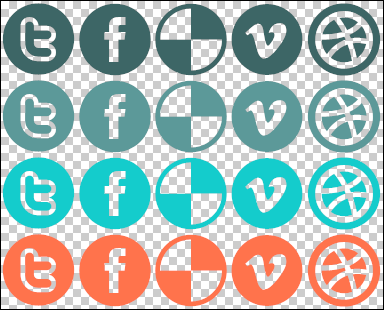
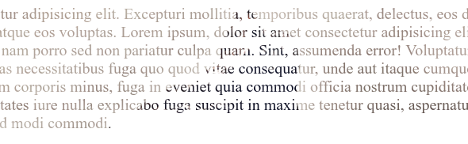

# Cont. CSS

## Border

`border` property is used to set the border of an element. It is a shorthand property for setting the `width`, `style`, and `color` of the border on different sides of an element, in the form `border: width style color;`.

To remove the default border, set to an element like button use `border: none;`.

---

`border-width`: It is used to set the width of the border. It takes values in `px`, `em`, `rem`, `%`, etc.

`border-width` can also be set individually for each side of the element using `border-top-width`, `border-right-width`, `border-bottom-width`, and `border-left-width`, or the shorthand property `border-width: top right bottom left;`.

---

`border-style`: It is used to set the style of the border. It can take values like:

- `solid`
- `dotted`
- `dashed`
- `double`
- `outset`
- `inset`

---

`border-color`: It is used to set the color of the border. It can take values like:

- `color-name`
- `#hex`
- `rgb()`
- `rgba()`
- `hsl()`
- `hsla()`
- `transparent`

---

`border-radius`: It is used to set the radius of the border. It can take values in `px`, `em`, `rem`, `%`, etc.

To make element look like a circle, set `border-radius` to `50%` if the element is a square (width and height are equal).

You can also set the radius individually for each corner of the element using:

- `border-top-left-radius`
- `border-top-right-radius`
- `border-bottom-left-radius`
- `border-bottom-right-radius`

## CSS Sprites

One of the important things you should take in mind as a web developer is the **HTTP requests**. The more the requests, the more the time it takes to load the page which will lower the performance of the website.

So to improve the performance of the website, we can use CSS sprites. CSS sprites are a way to reduce the number of HTTP requests made for image resources, by combining images in one file.

For example, consider the following image, It has 20 icons of different colors, each of 76x76 pixels and the whole image is 384x310 pixels.

{width=400px}

It has a lot of icons. Instead of loading each icon separately, we can combine all the icons in one image and use CSS to display the required icon.

```{.css .numberLines}
.icon {
    width: 76px;
    height: 76px;
    background-image: url('icons.png');
}

.icon-1 {
    background-position: 0 0;
}

.icon-2 {
    background-position: -76px 0;
}
```

## Background Clip

`background-clip`: It is used to specify the painting area of the background. It can take values like:

- `border-box` (default) - Starts placing the background **from the border** of the element.

{height=100px}

- `padding-box` - Starts placing the background **from the padding** of the element.

{height=100px}

- `content-box` - Starts placing the background **from the content** of the element.

{height=100px}

- `text` - Makes the background to be painted within the text, but the text `color` has to be set to `transparent`. ([Not supported in all browsers](https://caniuse.com/?search=background-clip%3Atext))

{height=100px}

## Viewport Units

Viewport units are a new set of units designed to be used in CSS for responsive design. They are relative to the viewport width and height.

Viewport is the browser window size. 1vw = 1% of viewport width, 1vh = 1% of viewport height.

<!-- اراجع علي الحتة بتاع ال text في النص -->

## Position

A CSS property that allows you to control the position of an element. It can take values like:

- `static` (default) - The element is positioned according to the normal flow of the document.
- `relative` - The element is positioned according to the normal flow of the document, and then offset relative to itself based on the values of `top`, `right`, `bottom`, and `left`.
- `absolute` - The element is removed from the normal flow of the document, and no space is created for the element in the page layout. It is positioned relative to its closest positioned ancestor if any; otherwise, it is placed relative to the initial containing block.
- `fixed` - The element is removed from the normal flow of the document, and no space is created for the element in the page layout. It is positioned relative to the initial containing block established by the viewport, except when one of its ancestors has a `transform`, `perspective`, or `filter` property set to something other than `none`, in which case that ancestor behaves as the containing block.
- `sticky` - The element is treated as `relative` positioned until it crosses a specified threshold, at which point it is treated as `fixed` positioned.

When using `position: relative;` the element will be positioned relative to its normal position.

```{.css .numberLines}
.relative-one {
    position: relative;
    top: 20px; /* Moves the element 20px down of its normal position */
    left: 20px; /* Moves the element 20px right of its normal position */
}

.relative-two {
    position: relative;
    top: 20px; 
    bottom: 20px; /* No effect since the page flows from top to bottom */
                  /* Normally no one will use top and bottom together */
}

.relative-three {
    position: relative;
    left: 20px; 
    right: 20px;  /* No effect since the page flows from left to right unless you change it */
                  /* Normally no one will also use right and left together */
}
```

In `static` position, the `top`, `right`, `bottom`, and `left` properties have no effect.

When using `position: absolute;` the element will be positioned relative to the viewport, unless its ancestor (parent or a parent of a parent) has a `position` property set to `relative`, `absolute`, `fixed`, or `sticky`, in which case it will be positioned relative to its ancestor.

```{.css .numberLines}
.absolute-one {
    position: absolute;
    top: 20px;  /* Moves the element 20px down of the top of the viewport */
    left: 20px; /* Moves the element 20px right of the left of the viewport */
}

.absolute-two {
    position: absolute;
    bottom: 0px;
    right: 0px; 
} /* Moves the element to the bottom right of the viewport */
```

When using `position: relative` the original place of the element will be reserved even if the element is moved away from it.

<!-- The element can also span over other elements. -->

When using `position: absolute` the original place of the element will not be reserved.

When using `position: fixed` the original place of the element will not be reserved.

When using `position: sticky` the original place of the element will be reserved until it reaches a specified threshold, at which point it is positioned relative to the viewport.

<!-- When using `position: fixed;` the element will be positioned relative to the viewport.

When using `position: sticky;` the element will be positioned relative to its normal position until it crosses a specified threshold, at which point it is positioned relative to the viewport.  -->

<!--
اراجع علي الجزء ده في الفيديو
relative positioning is mostly used in animations 
-->

`z-index` property is used to specify the stack order of an element. An element with greater `z-index` will be displayed above an element with a lower `z-index`.

The element with the greater `z-index` will be displayed above the element with the lower `z-index`.

default value for `z-index` is `auto`, which is the default order at which elements were written in the HTML code.

```{.html .numberLines}
<div class="one"></div>
<div class="two"></div>
<div class="three"></div>
```

```{.css .numberLines}
.one {
    position: relative;
    z-index: 1;
}

.two {
    position: relative;
    z-index: 3;
}

.three {
    position: relative;
    z-index: 2;
}
```

In the page `.two` will be displayed above `.three` and `.one` will be displayed below `.three`.

<!-- Stacking context اشوفها في الفيديو -->

Coloring System:

- color name
- hex `#RRGGBB`
- `rgb(r, g, b)`
- `rgba(r, g, b, a)` - a is the opacity

hex and opacity

to hide an element
`display: none`, // its space will be not be reserved
`visibility: hidden`, // its space will be reserved
`opacity: 0`, // its space will be reserved
