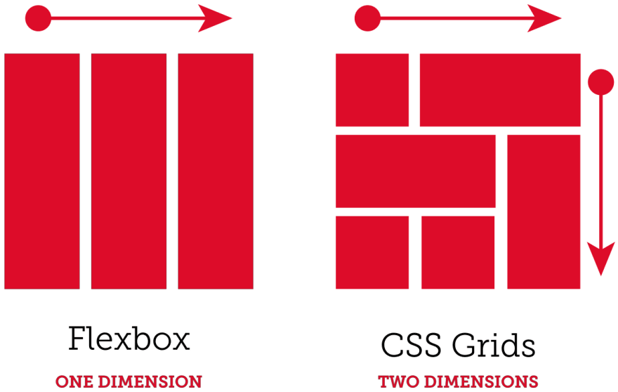
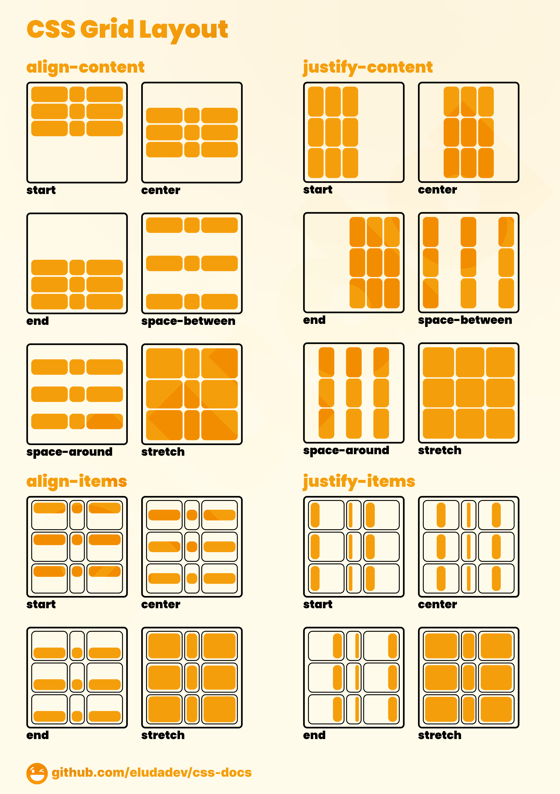

# Grid Layout

Grid is a CSS layout module that allows you to create two-dimensional grid-based layouts.

Most of the time we use grid used with 2 dimensional layouts, and flex with 1 dimensional layouts.

This image will help you understand the difference:

{width=350px}

## Display grid

To use grid, first we need to give the parent element a `display: grid` property.

Then we define the columns and rows of the grid.

```{.css .numberLines}
.container {
  display: grid;
  grid-template-columns: 200px 200px 200px;
}
```

## Grid Template Columns

`200px 200px 200px` means that we have 3 columns, each 200px wide, and if we have extra items they will wrap to the next row.

We can also use percentage values like `33% 33% 33%`, or use `auto` to make the columns automatically adjust to the content.

```{.css .numberLines}
.container {
  display: grid;
  grid-template-columns: auto auto auto;
}
```

We can also use fractional units like `1fr 1fr 1fr` to make the columns take up equal space.

```{.css .numberLines}
.container {
  display: grid;
  grid-template-columns: 1fr 1fr 1fr;
}
```

This will give use 3 equally spaced columns.

We can also give the middle column a double width by using `girl-template-columns: 1fr` `2fr 1fr`.

And we can mix units like `grid-template-columns: 1fr 200px auto`. Or `grid-` `template-columns: 1fr 20% 1fr` so each `1fr` will take up 40% of the width available.

## Grid Template Rows

Similarly we can define the rows of the grid using `grid-template-rows`.

```{.css .numberLines}
.container {
  display: grid;
  grid-template-rows: 100px 100px 100px;
}
```

Every thing we can do with columns, we can do with rows.

Also the default hight of a row is `auto`, so it will adjust to the content.

## Grid Template Shorthand Property

We can use the `grid-template` shorthand property to define both columns and rows.

It's used in the form: `grid-template: rows / columns`.

```{.css .numberLines}
.container {
  display: grid;
  grid-template: 100px 100px / 1fr 1fr 1fr;
}
```

So this will give us 2 rows each taking 100px high, and 3 columns each taking 1fr of the width.

## What is the difference between auto and fr?

`auto` will take up the space needed by the content, while `1fr` will take up the remaining space after the `auto` columns have been calculated.

## Repeat function

We can use the `repeat()` function to repeat the same column multiple times.

The `repeat` function takes two arguments, the number of times to repeat, and the size of each row/column.

```{.css .numberLines}
.container {
  display: grid;
  grid-template-columns: 200px repeat(3, 1fr);
}
```

This will give us 4 columns with the first one taking `200px` and the next 3 taking `1fr`.

<!-- `repeat` function only works with CSS Grid. -->

## Grid Template Areas

We can also use `grid-template-areas` to define the layout of the grid.

```{.css .numberLines}
.container {
  display: grid;
  grid-template-areas: 
    "header header header"
    "sidebar content content"
    "footer footer footer";
}
```

Then we assign the areas to the elements using the `grid-area` property.

```{.css .numberLines}
.header {
  grid-area: header;
}

.sidebar {
  grid-area: sidebar;
}

.content {
  grid-area: content;
}

.footer {
  grid-area: footer;
}
```

## Item Placement

### All Items

<!-- ### Parent Properties -->

We can use `justify-content` to align the items horizontally, and `align-items` to align them vertically.

Unlike CSS flexbox where `justify-content` aligns the items along the main axis and `align-items` along the cross axis, and the main axis and cross axis can be either horizontal or vertical depending on the direction of the flex container, in CSS grid `justify-content` always aligns the items along the x-axis and `align-content` along the y-axis.

Both `justify-content` & `align-content` can take values like:

- `start` (_default_)
- `center`
- `end`
- `space-between`
- `space-around`
- `space-evenly`

We also have a shorthand property `place-content` which combines both `justify-content` and `align-content`.

It works in the form: `place-content: align-content justify-content`.

So this:

```{.css .numberLines}
align-content: space-between;
justify-content: center;
```

Is equivalent to:

```{.css .numberLines}
place-content: space-between center;
```

We also have `justify-items` and `align-items` which are used to align the items **inside the grid cells**.

```{.css .numberLines}
.container {
  display: grid;
  grid-template-columns: 1fr 1fr 1fr;
  justify-items: center;
  align-items: center;
}
```

`justify-items` and `align-items` can take values like:

- `stretch` (_default_)
- `center`
- `start`
- `end`
<!-- - `baseline` -->

`stretch` will stretch the items to fill the cell.
<!-- , while `center` will center the items inside the cell. -->

We also have a shorthand property `place-items` which combines both `justify-items` and `align-items`.

It works in the form: `place-items: align-items justify-items`.

So this:

```{.css .numberLines}
align-items: center;
justify-items: start;
```

Is equivalent to:

```{.css .numberLines}
place-items: center start;
```

<!-- All the mentioned properties like `justify-content`, `align-content`, `place-content`, `justify-items`, `align-items`, and `place-items` only work with CSS Grid container. -->

This image will help you understand the difference between `justify-content`, `align-content` and `justify-items`, `align-items`:

{width=350px}

### Single Item

We can use `align-self` and `justify-self` to align a **single item** inside the grid cell.

```{.css .numberLines}
.item1 {
  align-self: center;
  justify-self: start;
}
```

`align-self` and `justify-self` can take values like:

- `stretch` (_default_)
- `center`
- `start`
- `end`

`stretch` will stretch the item to fill the cell.
<!-- , while `center` will center the item inside the cell. -->

We also have a shorthand property `place-self` which combines both `justify-self` and `align-self`.

It works in the form: `place-self: align-self justify-self`.

So this:

```{.css .numberLines}
align-self: center;
justify-self: start;
```

Is equivalent to:

```{.css .numberLines}
place-self: center start;
```

## Grid Gap

If we want to only make a gap between the rows we can use `row-gap` and for the columns we can use `column-gap`.

The shorthand property `gap` can be used to define both the row and column gap. It takes two values, the row gap and the column gap.

It takes either one value for both row and column gap, or two values for row then column gap.

So using `gap: 20px 10px;` will give us a 20px gap between the rows and a 10px gap between the columns, and `gap: 20px;` will give us a 20px gap between both rows and columns.

<!-- ## Child Properties -->

## Implicit Vs Explicit Grid

The explicit grid is the grid that we define using `grid-template-columns` and `grid-` `template-rows`.

The implicit grid is the grid that is created when we have more items than the number of columns and rows we defined.

By default, the implicit grid will create new rows to fit the extra items.

We can control how the implicit grid behaves using the `grid-auto-rows` and `grid-auto-` `columns` properties.

So for example using `grid-auto-rows: 100px;` will make any extra rows created by the implicit grid 100px high.

If you give `grid-auto-rows` more than one value, it will create rows with the height of the first value, then the second value, and so on.

For example using `grid-auto-rows: 100px 200px;` will make the first extra row 100px high, and the second extra row 200px high and so on.

<!-- We can use it instead of `grid-template-rows` to define the height of all the rows. -->

## Minmax function

We can use the `minmax()` function to define the minimum and maximum size of a row or column.

The `minmax()` function takes two arguments, the minimum size and the maximum size.

Using `grid-auto-rows: minmax(100px, auto);` any extra rows created by the implicit grid will have a minimum height of 100px and the maximum height will adjust to the content.

## Cell Spanning

We can make an item span multiple rows or columns using the `grid-row-start`, `grid-row-end`, and  `grid-column-start`, `grid-column-end` properties.

These properties take the line number where the item should start and the line number where it should end.

```{.css .numberLines}
.item1 {
  grid-column-start: 1;
  grid-column-end: 3;
}
```

This will make the item span from the first column to the third column.

We also have shorthand properties `grid-row` and `grid-column` that can be used to define both the start and end lines.

```{.css .numberLines}
.item1 {
  grid-column: 1 / 3;
}
```

So this is equivalent to the previous example.

\begin{box3}{Some Notes}

If we have only 3 columns and used \texttt{grid-column: 1 / 5;} the item will span from the first column to the fifth column, and the extra columns will be created by the implicit grid.

So you can use the property mentioned before \texttt{grid-auto-columns} to define the width of these columns.

\tcblower

To make an items span the whole row we can use \texttt{grid-column: 1 / -1;}.

We can also use \texttt{span} keyword to make the item span multiple columns or rows, \texttt{grid-column: 2/ span 2;} will make the item start from the second column and span 2 columns.

\end{box3}

The same thing can be done with rows.

## Naming Rows and Columns

We can name the rows and columns when defining the grid using the `grid-template-rows` and `grid-template-columns` properties.

```{.css .numberLines}
.container {
  display: grid;
  grid-template-columns: [startCol] 100px [col2] 100px [col3] 100px [endCol];
  grid-template-rows: [startRow] 100px [row2] 100px [row3] 100px [endRow];
}
```

Then we can use these names to place the items.

```{.css .numberLines}
.item1 {
  grid-column: startCol / col3;
  grid-row: startRow / row3;
}
```

## Parent Vs Child Properties

These properties are used with the grid container:

::: {.columns .ragged columngap=2.5em column-rule="0.0pt solid black"}

1. `grid-template-columns`
2. `grid-template-rows`
3. `grid-template`
4. `grid-template-areas`
5. `justify-content`
6. `align-content`
7. `place-content`
8. `justify-items`
9. `align-items`

\columnbreak

10. `place-items`
11. `grid-auto-rows`
12. `grid-auto-columns`
13. `row-gap`
14. `column-gap`
15. `gap`
16. `grid-auto-rows`
17. `grid-auto-columns`

:::

While these properties are used with the grid items:

::: {.columns .ragged columngap=2.5em column-rule="0.0pt solid black"}

1. `align-self`
2. `justify-self`
3. `place-self`
4. `grid-row-start`
5. `grid-row-end`

\columnbreak

6. `grid-row`
7. `grid-column-start`
8. `grid-column-end`
9. `grid-column`

:::

## Websites to Help You Create Grid Layouts

There are many websites that help you create grid layouts visually like:

- [CSS Grid Generator](https://cssgrid-generator.netlify.app/)
- [Grid Layout Generator](https://grid.layoutit.com/)

# CSS Variables

CSS variables are used to store reusable values.

They are defined using the `--` prefix.

```{.css .numberLines}
:root {
  --main-color: red;
}
```

Then we can use them in the CSS file using the `var()` function.

```{.css .numberLines}
h1 {
  color: var(--main-color);
}
```

We can also define fallback values for the variables.

```{.css .numberLines}
h1 {
  color: var(--main-color, blue);
}
```

If the `--main-color` variable is not defined, the color will be blue.

You can also use another variable as a fallback value.

```{.css .numberLines}
h1 {
  color: var(--main-color, var(--secondary-color, blue));
}
```

Since our variables are scoped we defined inside `:root` so they can be accessed from anywhere in the CSS file.

The **scope** of a variable is the area where it can be accessed. For example if we define a variable inside a `div` it will only be accessible inside that `div`.

You can store any value in a variable like colors, font sizes, font family, height, width, etc.

The `:root` is the same as the `html` element, so we can use `:root` or `html` to define the variables but since `:root` is a pseudo-class and `html` is an element, it's better to use `:root` since it has higher specificity.

Don't define your variables inside `body` as you may have more than one `body` element in your HTML file (_we will get to this later_).

When writing a CSS variable with more than one word we use a hyphen `-` to separate the words. You can also use capital letters but it's not recommended.

\pagebreak

# Summary

## Grid Layout

- Grid layout is a CSS module for creating 2D layouts.
- Use `display: grid` on the parent element.
- Define columns and rows using `grid-template-columns` and `grid-template-rows`.
  - Values can be pixels (`px`), percentages (`%`), `auto` (fits content), or `fr` (fractions of remaining space).

## auto vs. fr

- `auto` takes up the space needed by the content.
- `1fr` takes up the remaining space after `auto` columns are sized.

## Grid Template Areas

- Define areas using `grid-template-areas` property.
- Assign grid items to areas using `grid-area` property.

## Item Placement

- `justify-content` & `align-content` align items within the container.
  - Works along x and y axis respectively.
  - Values include `start`, `center`, `end`, `space-between`, etc.
- `justify-items` & `align-items` align items within grid cells.
  - Values include `stretch` (default), `center`, `start`, `end`.
- `align-self` & `justify-self` align a single item within its cell.
- Shorthand properties available for combining these: `place-content`, `place-items`, `place-self`.

## Grid Gap

- `row-gap` and `column-gap` define gaps between rows and columns respectively.
- `gap` is a shorthand property for both.

## Implicit vs. Explicit Grid

- Explicit grid is defined using `grid-template-columns` and `grid-template-rows`.
- Implicit grid creates rows for extra items.
- `grid-auto-rows` and `grid-auto-columns` control implicit grid behavior.

## Cell Spanning

- Use `grid-column-start`, `grid-column-end`, `grid-row-start`, and `grid-row-` `end` to span cells.
- Shorthand properties (`grid-row`, `grid-column`) available.

## Naming Rows & Columns

- Define named rows and columns within `grid-template-rows` and `grid-template-` `columns`.
- Use these names for item placement with `grid-row` and `grid-column`.

## Parent vs. Child Properties

- Parent properties define the overall grid layout. Listed [Here](#parent-vs-child-properties).

- Child properties define individual item placement.

## Sites for Creating Grid Layouts

- [CSS Grid Generator](https://cssgrid-generator.netlify.app/)
- [Grid Layout Generator](https://www.layoutit.com/cn)

## CSS Variables

- Store reusable values with `--` prefix.
- Use `var()` function to reference variables in CSS.
- Define fallback values for variables.
- Variables are scoped (accessible within their defined area).
- Use `:root` (same as `html`) for global access.
- Use hyphens (-) in multi-word variable names.
