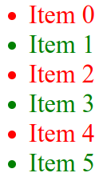

# Operators In JavaScript

## Arithmetic Operators

Arithmetic operators in JS are: `+`, `-`, `*`, `/`, `**`, and `%`.

The `%` operator returns the remainder of a division, for example if `x = 5` and `y = 2`, then `x % y` is `1`. When the remainder is `0`, it means that `y` is divisible by `x`.

When `+` is used with strings, it concatenates them, for example:

```{.js .numberLines}
var x = "Hello" + "World"; // x is "HelloWorld"
var y = "Hello" + 1 + 2;   // y is "Hello12"
var z = 1 + 2 + "Hello";   // z is "3Hello"
```

## Assignment Operators

Assignment operators in JS are: `=`, `+=`, `-=`, `*=`, `/=`, `**=`, and `%=`.

## Comparison Operators

Comparison operators in JS are: `==`, `===`, `!=`, `!==`, `>`, `<`, `>=`, and `<=`.

```{.js .numberLines}
var x = 5;
var y = 5;
console.log(x >= y);  // true

x = "5";
console.log(x == y);  // true
console.log(x != y);  // false

console.log(x === y); // false
console.log(x !== y); // true
```

So what is the difference between `==` and `===`?

- `==` is used to compare values, while `===` is used to compare values and types.
- `console.log(x == y);` is true because JS converts the string to a number if possible.
- `console.log(x === y);` is false because `===` does not convert the types.

## Logical Operators

Logical operators in JS are: `&&`, `||`, and `!` (AND, OR, and NOT).

Explanation:

- `&&` is true if all conditions are true and false if at least one condition is false.
- `||` is true if at least one condition is true and false if all conditions are false.
- `!` is used to reverse the result, so if a condition evaluates to true, `!` will make it false.

```{.js .numberLines}
var x = 5;
var y = 10;
console.log(x > 3 && y < 20);  // true
console.log(x > 3 || y > 20);  // true
console.log(!(x > 3));         // false
```

Logical operators are commonly used in to make decisions in JS using conditional statements.

# Conditional Statements

## If Statement

The `if` statement is used to execute a block of code if a condition is true.

```{.js .numberLines}
var x = 5;
if (x > 0) {
  console.log("x is positive");
}
```

The statement `console.log("x is positive");` will only be executed if `x > 0`.

## Else Statement

The `else` statement is used to execute a block of code if the same condition is false.

```{.js .numberLines}
var x = -5;
if (x > 0) {
  console.log("x is positive");
} else {
  console.log("x is negative");
}
```

## Else If Statement

The `else if` statement is used to specify new conditions if the previous conditions are false.

```{.js .numberLines}
var skill = "HTML";
if (skill == "CSS") {
  console.log("CSS");
} else if (skill == "HTML") {
  console.log("HTML");
} else if (skill == "JavaScript") {
  console.log("JavaScript");
} else {
  console.log("Another skill");
}
```

Here if `skill` is not `CSS` it checks if it is `HTML`, and if not, it checks if it is `JavaScript` and if not, it prints `Another skill`.

## Nesting If Statement

A nested `if` statement is an `if` statement inside another `if` statement.

```{.js .numberLines}
var x = 10;
var y = 20;
if (x == 10) {
  if (y == 20) {
    console.log("x is 10 and y is 20");
  }
}
```

## Switch Statement

The `switch` statement is used to perform different actions based on different conditions.

```{.js .numberLines}
var day = 3;
switch (day) {
  case 1:
    console.log("Monday");
    break;
  case 2:
    console.log("Tuesday");
    break;
  case 3:
    console.log("Wednesday");
    break;
  default:
    console.log("Another day");
}
```

The `break` statement is used to break out of the switch block, because JS will execute the next switch case if a `break` is not found.

Switch statement has a better performance than if-else statement.

## Nested Switch Statement

A nested `switch` statement is a `switch` statement inside another `switch` statement.

```{.js .numberLines}
var day = 3;
var month = 4;
switch (day) {
  case 1:
    console.log("Monday");
    break;
  case 2:
    console.log("Tuesday");
    break;
  case 3:
    switch (month) {
      case 4:
        console.log("Wednesday, April");
        break;
      case 5:
        console.log("Wednesday, May");
        break;
      default:
        console.log("Another Month");
    }
    break;
  default:
    console.log("Another day");
}
```

## Falsey Values

Falsey values in JS are values that are considered false when evaluated in a boolean expression. They include: `false`, `0`, `""`, `null`, `undefined`, and `NaN`.

```{.js .numberLines}
var x = "";
var y = "Mohamed";
console.log(x && y);  // prints nothing
console.log(x || y);  // Mohamed
```

The first `console.log` prints nothing because `x` is falsey and we are using the `&&` operator so both conditions must be true to execute the statement, while the second `console.log` prints `Mohamed` because `y` is truthy and we are using the `||` operator so only one condition must be true to execute the statement.

The `&&` stops evaluating with the first false value, while the `||` stops evaluating with the first true value.

# Loops

Loops are used to execute the same block of code multiple times.

## For Loop

The `for` loop is used to execute a block of code a number of times.

Syntax:

```{.numberLines}
for (initialization; condition; step) {
  // code block to be executed
}
```

<!-- If you leave any of the parts empty, you have to use a semicolon. -->

Example:

```{.js .numberLines}
for (var i = 0; i < 5; i++) {
  console.log(i);
}
```

The loop will print the numbers from `0` to `4`.

`i++` is the same as `i = i + 1`, `i += 1`.

To print even numbers from `0` to `10`:

```{.js .numberLines}
for (var i = 0; i <= 10; i += 2) {
  console.log(i);
}
```

These two code blocks will print forever (infinitive loop):

::: {.columns .ragged columngap=2.5em column-rule="0.0pt solid black"}

```{.js .numberLines}
for (;;) {
  console.log("Hello");
}
```

\columnbreak

```{.js .numberLines}
for (var i = 0; i < 5;) {
  console.log(i);
}
```

:::

While this one will cause an error because of a missing `;`:

```{.js .numberLines}
for (;) {
  console.log("Hello");
}
```

## While Loop

The `while` loop is used to execute a block of code as long as a condition is true.

Syntax:

```{.numberLines}
while (condition) {
  // code block to be executed
}
```

Example:

```{.js .numberLines}
var i = 0;
while (i < 5) {
  console.log(i);
  i++;
}
```

The loop will print the numbers from `0` to `4`.

## Do While Loop

The `do while` loop is a variant of the `while` loop. This loop will execute the code block once, before checking if the condition is true, then it will repeat the loop as long as the condition is true.

Syntax:

```{.numberLines}
do {
  // code block to be executed
} while (condition);
```

Example:

```{.js .numberLines}
var i = 0;
do {
  console.log(i);
  i++;
} while (i < 5);
```

## Using Loops With HTML Elements

You can use loops to manipulate HTML elements.

In HTML:

```{.html .numberLines}
<ul id="list">
</ul>
```

In JS:

```{.js .numberLines}
var list = document.getElementById("list");
for (var i = 0; i < 6; i++) {
  if (i % 2 === 0) {
    var item = "<li class='red'>Item " + i + "</li>";
  } else {
    var item = "<li class='green'>Item " + i + "</li>";
  }
  list.innerHTML += item;
}
```

You can even use the classes to style the elements.

```{.css .numberLines}
.red {
  color: red;
}

.green {
  color: green;
}
```

{height=130px}

# Summary

- Operators in JS include arithmetic, assignment, comparison, and logical operators.
- Arithmetic operators include `+`, `-`, `*`, `/`, `**`, and `%`.
  - `+` is used to concatenate strings.
  - `%` returns the remainder of a division.
- Assignment operators include `=`, `+=`, `-=`, `*=`, `/=`, `**=`, and `%=`.
- Comparison operators include `==`, `===`, `!=`, `!==`, `>`, `<`, `>=`, and `<=`.
  - `==` is used to compare values, while `===` is used to compare values and types.
- Logical operators include `&&`, `||`, and `!`.
- Conditional statements include `if`, `else`, `else if`, and `switch`.
  - `if` is used to execute a block of code if a condition is true.
  - `else` is used to execute a block of code if the same condition is false.
  - `else if` is used to specify new conditions if the previous conditions are false.
  - `switch` is used to perform different actions based on different conditions.
    - `break` is used with `switch` to break out of a case, otherwise JS will execute the next cases till the end.
    - `default` is used with `switch` to execute a block of code if no case is true.
- Falsey values are values that are considered false in a boolean expression, they include `false`, `0`, `""`, `null`, `undefined`, and `NaN`.
- Loops include `for`, `while`, and `do while`.
  - `for` is used to execute a block of code a number of times.
  - `while` is used to execute a block of code as long as a condition is true.
  - `do while` is used to execute a block of code once before checking the condition.
