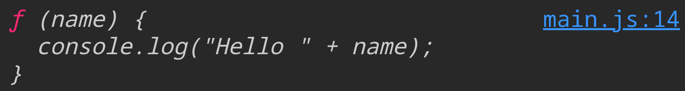

\begin{box3}{\textbf{Important Note}}

This session discusses a lot of important and tricky concepts that gets asked frequently in interviews. So, make sure you understand the concepts well.

\end{box3}

# Implicit Conversion

Implicit conversion is the automatic conversion of a value from one data type to another. This is done by the JavaScript engine when the data type of the operands in an expression are different.

For example when you add a number and a string, JavaScript will convert the number to a string and concatenate the two strings.

::: {.columns .ragged}

```{.js .numberLines #exec}
var a = 20;
var b = "10";
var c = a + b;
console.log("c = " + c);
var f = a - b;
console.log("f = " + f);
var d = a * b;
console.log("d = " + d);
var e = a / b;
console.log("e = " + e);
```

\columnbreak

As you see the results below the code:

- `c` equals `2010` because `a` is converted to a string and concatenated with `b`.
- `f` equals `10` because `b` is converted to a number and subtracted from `a`.
- `d` equals `200` because `b` is converted to a number and multiplied by `a`.
- `e` equals `2` because `b` is converted to a number and divided by `a`.

:::

**But what if the value can't be converted to the desired data type?** In this case, the result will be `NaN` (Not a Number).

::: {.columns .ragged}

```{.js .numberLines #exec}
var a = 20;
var b = "Hello";
var c = a - b;
console.log("c = " + c);
```

\columnbreak

The result will be `NaN` because the string `Hello` can't be converted to a number to be subtracted from `a`.

:::

Lets see the result of string to number conversion of some strings.

```{.js .numberLines #exec}
console.log( 'true = ' + Number(true))
console.log( 'false = ' + Number(false))
console.log( '"0" = ' + Number('0'))
console.log( 'null = ' + Number(null))
console.log( 'undefined = ' + Number(undefined))
console.log( '"" = ' + Number(''))
console.log( 'NaN = ' + Number(NaN))
```

- `true` will be converted to `1` and `false` will be converted to `0`.
- Since the string `0` can be converted to a number, the result will be `0`.
- `null`, `""` will be converted to `0`.
- `undefined` will be converted to `NaN`.
- `NaN` stays as `NaN`.

What about adding these values to a number?

```{.js .numberLines #exec}
console.log( 'true + 1 = ' + (true + 1))
console.log( 'false + 1 = ' + (false + 1))
console.log( 'null + 1 = ' + (null + 1))
console.log( 'undefined + 1 = ' + (undefined + 1))
console.log( 'NaN + 1 = ' + (NaN + 1))
```

What about adding these values to a string?

```{.js .numberLines #exec}
console.log( 'true + "1" = ' + (true + "1"))
console.log( 'false + "1" = ' + (false + "1"))
console.log( 'null + "1" = ' + (null + "1"))
console.log( 'undefined + "1" = ' + (undefined + "1"))
console.log( 'NaN + "1" = ' + (NaN + 1))
```

Lets try some extra examples.

```{.js .numberLines #exec}
console.log( 'true + true = ' + (true + true))
console.log( 'true + false = ' + (true + false))
console.log( 'false + false = ' + (false + false))
console.log( 'true + null = ' + (true + null))
console.log( 'true + undefined = ' + (true + undefined))
console.log( 'true + NaN = ' + (true + NaN))
```

Some extra examples:

```{.js .numberLines #exec}
console.log( '"3" * false = ' + ("3" * false))
console.log( '"3" * true = ' + ("3" * true))
console.log( '"3" / false = ' + ("3" / false))
console.log( '"3" / true = ' + ("3" / true))
```

# Function

Functions are reusable blocks of code that can be called multiple times. They can take parameters and return values.

Functions are defined using the `function` keyword followed by the function name and a list of parameters in parentheses. The function body is enclosed in curly braces `{}`.

Functions parameters are created without using `var` keyword.

```{.numberLines}
function FunctionName (parameter1, parameter2, ...) {
    // function body
}
```

And to use the function you have to call it, just write the function name followed by parentheses and any arguments you want to pass to the function.

The arguments are the values of the parameters that the function will use.

Example:

```{.js .numberLines #exec}
function greet(name) {
    console.log("Hello " + name);
}
greet("World");
```

The `greet("World")` is called a function call or invocation. The value inside the parentheses is called an argument.

For reusability purposes, it's preferred that each function does only one thing, this is called the single responsibility principle.

Functions can access already defined variables in the global scope.

```{.js .numberLines #exec}
var name = "World";
function greet() {
    console.log("Hello " + name);
}
greet();
```

## Return Value

Functions can return a value using the `return` keyword followed by the value to return.

```{.js .numberLines #exec}
function add(a, b) {
    return a + b;
}
var result = add(10, 20);
console.log("result = " + result);
```

Any code after the `return` statement will not be executed.

The function that doesn't have a `return` statement will return `undefined`.

```{.js .numberLines #exec}
function greet(name) {
    console.log("Hello " + name);
}
var result = greet("World");
console.log("result = " + result);
```

The first output line here `Hello World` is because of the `console.log` inside the function, and the second output line `result = undefined` is because the function doesn't have a `return` statement.

A return function is the function that have a return statement.

Return is used when you want to get a value from a function to use it in another part of the code.

You can even return another function.

## Function Types

### Declaration Function

This is the most common way to define a function. It is defined using the `function` keyword followed by the function name.

Declaration functions always start with the `function` keyword.

```{.js .numberLines #exec}
function greet(name) {
    console.log("Hello " + name);
}
greet("World");
```

### Expression Function

This is when you assign a function to a variable.

```{.js .numberLines #exec}
var greet = function(name) {
    console.log("Hello " + name);
}
greet("World");
```

In this example, the function is assigned to the `greet` variable and then called using the variable.

When you print the value of the `greet` variable you will get the function definition.

```{.js .numberLines}
console.log(greet);
```

{width=500px}

# User Input

To get a value from user you can use the `prompt` function. This function will show a dialog box to the user with a message and an input field, and it will return the value entered by the user.

```{.js .numberLines}
var name = prompt("Enter your name");
console.log("Hello " + name);
```

This code will make a dialog box appear with the message "Enter your name" and an input field. The value entered by the user will be stored in the `name` variable then it will be printed to the console.

# Some Interview Notes

What will be the result of this code?

::: {.columns .ragged columngap=1.5em}

```{.js .numberLines}
function salaryBonus(salary) {  
    console.log(salary + 100);
}
salaryBonus();
salaryBonus(100);
salaryBonus(100, 200);
```

\columnbreak

The results will be:

1. `NaN` because `salary` is not defined so `undefined + 100` is `NaN`.
2. `200` because `salary` is `100`.
3. `200` because `salary` is `100` and `200` is ignored.

:::

# Hoisting

JavaScript hoisting is a mechanism where variable and function declarations are moved to the top of their containing scope during the compilation phase.

That is the reason why when you print the value of a variable before declaring it, you will get `undefined` instead of an error.

```{.js .numberLines #exec}
console.log(a);
var a = 10;
```

But if you just print the value of a variable without declaring it, you will get an error.

```{.js .numberLines}
console.log(a);
```

With the code above you will get: `ReferenceError: a is not defined`

Since hoisting also works with functions, you can call a function before declaring it.

```{.js .numberLines #exec}
greet("World");
function greet(name) {
    console.log("Hello " + name);
}
```

These weird behaviors happen because of hoisting.

You should notice that only the declaration is hoisted not the initialization, so if you have `var a = 10;` the `var a;` part will be hoisted but the `a = 10;` part will not and that is why you get `undefined` when you print the value of `a`.

So these are equivalent and both will print `undefined`.

::: {.columns .ragged columngap=1.5em}

```{.js .numberLines #exec}
console.log(a);
var a = 10;
```

\columnbreak

```{.js .numberLines #exec}
var a;
console.log(a);
a = 10;
```

:::

# Hoisting With Function Types

## Declaration Functions Hoisting

Declaration functions get hoisted so you can call the function before declaring it.

## Expression Functions Hoisting

Expression functions don't get hoisted since only the variable declaration gets hoisted and not the initialization (which is the function definition)

For example in:

```{.js .numberLines}
var greet = function(name) {
    console.log("Hello " + name);
}
```

only `var greet;` gets hoisted.

so you can't call an expression function before the line it was assigned to the variable. In other words to make a function that can only be called after its definition use expression function.

# Scope

Scope is the context in which a variable is defined. JavaScript has two types of scope: **global scope** and **local scope**.

## Global Scope

A variable is in the global scope if it's declared outside of any function or block.

```{.js .numberLines}
var a = 10;
function getNum() {
    console.log(a);
}
getNum();
```

In this example, the variable `a` is declared in the global scope and **can be accessed** from the `getNum` function.

## Local Scope

A variable is in the local scope if it's declared inside a function or block.

```{.js .numberLines}
function getNum() {
    var a = 10;
}
console.log(a);
```

In this example, the variable `a` is declared in the local scope of the `getNum` function and **can't be accessed** from outside the function, so you will get `ReferenceError: a is not defined`.

Inside a function you can access the variables of the global scope but in the global you can't access the variables of the function local scope.

The normal behavior assumes that each `{ }` creates a new scope but this is not the case when using `var` keyword, so if you create a loop or an if condition for example and declared variables inside their `{ }` using `var` keyword, you still can access these variables from outside the `{ }`, and the only exception is the function scope. The same happens with whole functions if you declared a function inside another function you can only access it from inside the function.

## Qestions

\begin{center}
\bf{\textit{What will be the output of each of these codes?}}
\end{center}

\begin{center}
\bf{\textit{Code 1}}
\end{center}

```{.js .numberLines #exec}
var a = 10;
function myFunction() {
    var a = 20;
    console.log(a);
}
myFunction();
console.log(a);
```

The output of the function call will be 20 and the output of the second `console.log` will be 10 because the function accessed the variable in the local scope which had the value `20` while the `console.log` accessed the variable in the global scope which had the value `10`.

\begin{center}
\bf{\textit{Code 2}}
\end{center}

```{.js .numberLines #exec}
var a = 10;
function myFunction() {
    console.log(a);
    a = 20;
}
myFunction();
console.log(a);
```

The output of the function call will be 10 and the output of the second `console.log` will be 20 because the function accessed the variable in the global scope which had the value `10` and changed it to `20` then the `console.log` accessed the same variable after it was changed.

\begin{center}
\bf{\textit{Code 3}}
\end{center}

```{.js .numberLines #exec}
var a = 10; 
function myFunction() {
    console.log(a);
    var a = 20;
}
myFunction()
console.log(a);
```

The output of the function call will be `undefined` and the output of the second `console.log` will be `10` because the function accessed the variable in the local scope which was hoisted to the top of the function but not initialized yet so it was `undefined` while the `console.log` accessed the variable in the global scope which had the value `10`.

Notice that the variable inside the function gets hoisted to the top of the function not to the top of the global scope.

\begin{center}
\bf{\textit{Code 4}}
\end{center}

```{.js .numberLines #exec}
function foo() {
    function bar(){ return 3;}
    function bar(){ return 8;}
    return bar();
}
console.log(foo())
```

The output will be `8` because the second function definition will override the first one.

\begin{center}
\bf{\textit{Code 5}}
\end{center}

```{.js .numberLines #exec}
function foo() {
    var bar = function(){ return 3;}
    return bar();
    var bar = function(){ return 8;}
}
console.log(foo())
```

The output will be `3` because the second function definition will be ignored because it's an expression function that is not hoisted so only the variable declaration will be hoisted and the value of the variable will be the first function.

\begin{center}
\bf{\textit{Code 6}}
\end{center}

```{.js .numberLines #exec}
function foo() {
    function bar(){ return 3;}
    return bar();
    function bar(){ return 8;}
}
console.log(foo())
```

The output will be `8` because both functions are declaration functions so both will be hoisted (in the same order they were defined) and the second function will override the first one.

Its equivalent to this code:

```{.js .numberLines}
function foo() {
    function bar(){ return 3;}
    function bar(){ return 8;}
    return bar();
}
console.log(foo())
```

\begin{center}
\bf{\textit{Code 7}}
\end{center}

```{.js .numberLines #exec}
function foo(){
    return bar();
    function bar(){ return 3;}
    var bar = function(){ return 8;}
}
console.log(foo())
```

The output will be `3` because the declaration function definition will be hoisted to the top before the return statement while in the expression function definition only the variable declaration will be hoisted but not the function assigned to it, you should also know that the value returned here is the result of the function call since we are using `()` after the function name but if we remove the `()` the value returned will be the function definition similar to \ref{imglabel}.

The code above is equivalent to this code which will also print `3`:

```{.js .numberLines}
function foo(){
    function bar(){ return 3;}
    var bar;
    return bar();
    bar = function(){ return 8;}
}
console.log(foo())
```

\begin{center}
\bf{\textit{Code 8}}
\end{center}

```{.js .numberLines}
console.log(foo())
var foo = function(){
    return bar();
    function bar(){ return 3; }
    var bar = function(){ return 8; }
}
```

The output will be `TypeError: foo is not a function` because the variable `foo` is hoisted to the top but not initialized yet so it's value is `undefined` and you can't call `undefined` as a function. (if you `console.log(foo)` you will get `undefined`)

# Self Inovked Function

It's also called IIFE (Immediately Invoked Function Expression). It's a function that is called immediately after it's defined.

Syntax:

```{.js .numberLines}
(function() {
    // function body
})();
```

We use IIFEs to create a new scope for our code so we can use variables without polluting the global scope.

<!-- 

=========================================

but expression function can be defined without a name and that is called anonymous function.

So in summary declaration functions are hoisted and can be called before declaring them but expression functions are not hoisted and can't be called before the line they were assigned to the variable in.

=========================================

- With function the whole function definition is hoisted so you can call the function before declaring it.
- What happens if we use the variable without using var or let (im not talking about hoisting im talking about using the variable without declaration in js in general)
- The initialization is not hoisted because the variable can have different values so which value should be hoisted?
- What is return function in js?

========================================= 

The third line which has `var bar;` will not reset the value of ...........
-->
