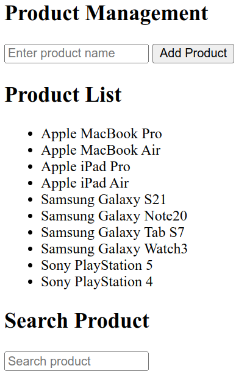
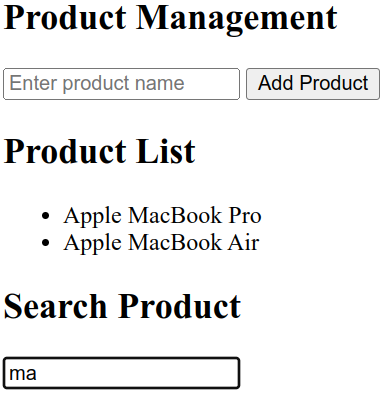

<!-- # CRUD System Cont -->

# Local Storage

Local storage is a way to store data in the browser (client-side storage). It is a key-value pair storage limited storage (5MB).

When we say it's Local Storage, it means it's local to the browser. It is not stored on the server. It is stored on the client's machine, so it is not shared with other users.

<!-- - It is a synchronous storage. 
- It is a persistent storage.
- It is a secure storage.
- It is a storage that is only accessible by the same origin.
- It is a storage that is only accessible by the same protocol.
- It is a storage that is only accessible by the same port.
- It is a storage that is only accessible by the same domain.
- It is a storage that is only accessible by the same subdomain. -->

To see the local storage in the browser, open the developer tools and go to the Application tab. Then, click on Local Storage.

You can *only store strings* in the local storage.
<!-- If you want to store an object, you need to convert it to a string using `JSON.stringify()`. -->

To store a value in the local storage, you can use the `setItem()` method. The `setItem()` method takes two parameters: the key and the value.

```{.js .numberLines}
localStorage.setItem('name', 'Mohamed');
```

Keys are unique. If you set a value to a key that already exists, it will overwrite the old value.

```{.js .numberLines}
localStorage.setItem('name', 'Ahmed');
```

Now the value of the key `name` is `Ahmed`.

To get a value from the local storage, you can use the `getItem()` method. The `getItem()` method takes one parameter: the key.

```{.js .numberLines}
var name = localStorage.getItem('name');
console.log(name); // Ahmed
```

To remove a value from the local storage, you can use the `removeItem()` method. The `removeItem()` method takes one parameter: the key.

```{.js .numberLines}
localStorage.removeItem('name');
var name = localStorage.getItem('name');
console.log(name); // null
```

To know how many items are stored in the local storage, you can use the `length` property.

To clear the local storage, you can use the `clear()` method. The `clear()` method takes no parameters.

```{.js .numberLines}
localStorage.setItem('name', 'Mohamed');
localStorage.setItem('age', '25');
console.log(localStorage.length); // 2
localStorage.clear();
var name = localStorage.getItem('name');
var age = localStorage.getItem('age');
console.log(name); // null
console.log(age);  // null
```

To know which key at a specific index, you can use the `key()` method. The `key()` method takes one parameter: the index.

```{.js .numberLines}
localStorage.setItem('name', 'Mohamed');
localStorage.setItem('age', '25');
console.log(localStorage.key(0)); // name
console.log(localStorage.key(1)); // age
```

You shouldn't store sensitive data in the local storage because it's not secure. It's accessible by anyone who has access to the client's machine.

We don't get all data from backend some data that are not sensitive like language. can be stored in the local storage.

Local storage data are not removed even if you close the browser. It will be removed when you clear the local storage or when you delete the browser's data.

# Session Storage

Session storage is similar to local storage, but it's for the session only which means it's removed when the session is ended like when you close the tab or the browser.

We have a method called `sessionStorage` that works the same as `localStorage` with the same methods and properties like:

::: {.columns .ragged columngap=2.5em column-rule="0.0pt solid black"}

- `setItem()`
- `getItem()`

\columnbreak

- `removeItem()`
- `length`

\columnbreak

- `clear()`
- `key()`

:::

# Storing Objects

As we mentioned before, you can only store strings in the local storage. If you want to store an object, you need to convert it to a string using `JSON.stringify()`.

```{.js .numberLines}
var person = {
  name: 'Mohamed',
  age: 25
};

localStorage.setItem('person', JSON.stringify(person));
```

To get the object from the local storage, you need to parse the string using `JSON.parse()`.

```{.js .numberLines}
var person = JSON.parse(localStorage.getItem('person'));
console.log(person.name); // Mohamed
console.log(person.age);  // 25
```

The same can be done with arrays:

```{.js .numberLines}
var people = [
  { name: 'Mohamed', age: 25 },
  { name: 'Ahmed', age: 30 },
  { name: 'Ali', age: 35 }
];

localStorage.setItem('people', JSON.stringify(people));
var people = JSON.parse(localStorage.getItem('people'));
console.log(people[1]); // { name: 'Ahmed', age: 30 }
```

# Accepting Image As Input

With the input element where the user can select an image, you will specify the type as `file` you can also specify the `accept` attribute to specify the type of files that the user can select, for example, `image/png`, `image/jpeg`, or `image/*` to accept all image types, and you can also use the attribute `multiple` to allow the user to select multiple files.

```{.html .numberLines}
<input type="file" accept="image/*" id="imgInput" />
<button id="upload">Upload</button>
```

This will create an input field that accepts all image types.

In your JavaScript code when you `console.log` the value of the file input element, you will get a `C:\fakepath\` followed by the image file name, so for example if your image file name is `my_image.jpg` the console output will be `C:\fakepath\my_image.jpg`

```{.js .numberLines}
var imgInput = document.getElementById('imgInput');
console.log(imgInput.value); // C:\fakepath\my_image.jpg
```

This `C:\fakepath\` is a browser standard that doesn't depend on the operating system and it's used by the browser with any file the user uploads not just images. This is done for security reasons to prevent the website from knowing the user's file system structure.

For example if the real file path was `C:\Users\Ahmed\TopSuperSecretProject\Very ImportantImg.png`, then by uploading it you'd be exposing that your real name is Ahmed and you're working on TopSuperSecretProject which is a security risk.

Since `C:\fakepath\` is a browser standard, you can see it in any operating system even those with no `C:\` partition like macOS or Linux.

So how can you display the image?

<!-- You can get the file object from the input element and then get the file name from the file object. -->

<!-- ```{.js .numberLines}
var imgInput = document.getElementById('imgInput');
var upload = document.getElementById('upload');
upload.onclick = function() {
  var file = imgInput.files[0];
  console.log(file.name);
};
``` -->

You can get the file object from the input element using the `files` property. The `imgInput.files` is a FileList object that contains the multiple files the user selected in case the input element has the `multiple` attribute. If the input element doesn't have the `multiple` attribute, then you can access the one file using `imgInput.files[0]`.

You can access the file name using `name` property.

```{.js .numberLines}
var imgInput = document.getElementById('imgInput');
console.log(imgInput.files[0].name); // my_image.jpg
```

<!-- When working with our project we can suppose that the path of the image is the same as the path of the images folder in the project so if our image folder is `./assets/images/` and the image user selected is `my_image.jpg` then the path of the image will be `./assets/images/my_image.jpg`. 

```{.js .numberLines}
var imgInput = document.getElementById('imgInput');
var upload = document.getElementById('upload');
upload.onclick = function() {
  var file = imgInput.files[0];
  var path = `./assets/images/${file.name}`;
  console.log(path);
};
```-->

To display the image we get the file object from the input element, then we use the `createObjectURL()` method to create a URL for the file object, then we can use that URL to display the image in the browser using the `src` attribute of an image element.

Consider this example:

In HTML:

```{.html .numberLines}
<input type="file" accept="image/*" id="imgInput" />
<button id="upload">Upload</button>

```

In JavaScript:

```{.js .numberLines}
var imgInput = document.getElementById('imgInput');
var upload = document.getElementById('upload');
var img = document.getElementById('img');
upload.onclick = function() {
  var file = imgInput.files[0];
  if (file) {
    var objectURL = URL.createObjectURL(file);
    // set the src attribute of the image element to the object URL
    img.src = objectURL;
  }
};
```

This is how the page will look like:

{width=70%}

# String Methods

Strings have many methods that you can use to manipulate strings. Here we will discuss some of the most common methods.

<!-- - `length`: returns the length of the string.
- `charAt()`: returns the character at a specified index.
- `charCodeAt()`: returns the Unicode of the character at a specified index.
- `concat()`: concatenates two or more strings.
- `indexOf()`: returns the index of the first occurrence of a specified value in a string.
- `lastIndexOf()`: returns the index of the last occurrence of a specified value in a string.
- `match()`: searches a string for a match against a regular expression, and returns the matches.
- `replace()`: searches a string for a specified value, or a regular expression, and returns a new string where the specified values are replaced.
- `search()`: searches a string for a specified value, or regular expression, and returns the position of the match.
- `slice()`: extracts a part of a string and returns a new string.
- `split()`: splits a string into an array of substrings.
- `substr()`: extracts a specified number of characters in a string, from a start index.
- `substring()`: extracts the characters in a string between two specified indices.
- `toLowerCase()`: converts a string to lowercase letters.
- `toUpperCase()`: converts a string to uppercase letters.
- `trim()`: removes whitespace from both ends of a string.
- `startsWith()`: checks if a string starts with a specified value.
- `endsWith()`: checks if a string ends with a specified value.
- `includes()`: checks if a string contains a specified value.
- `repeat()`: returns a new string with a specified number of copies of an existing string. -->

## `charAt()`, `[]`, `at()`

The `charAt()` method returns the character at a specified index (position) in a string.

```{.js .numberLines}
var str = 'Hello, World!';
console.log(str.charAt(0)); // H
console.log(str.charAt(7)); // W
```

You can also use square brackets `[]` to access the character at a specific index.

```{.js .numberLines}
var str = 'Hello, World!';
console.log(str[0]); // H
console.log(str[7]); // W
```

The `at()` method returns the character at a specified index (position) in a string, but it also *supports negative indexes*.

```{.js .numberLines}
var str = 'Hello, World!';
console.log(str.at(0)); // H
console.log(str.at(7)); // W
console.log(str.at(-1)); // !
console.log(str.at(-3)); // l
```

## `slice()`

The `slice()` method extracts a part of a string and returns a new string.

The `slice()` method takes two parameters: the start index and the end index. The `slice()` method extracts up to *but not including the end index*.

If you don't specify the end index, the `slice()` method will extract to the end of the string.

The `slice()` method also supports negative indexes.

Syntax:

```{.js .numberLines}
string.slice(start, end(optional))
```

Example:

```{.js .numberLines}
var str = 'Hello, World!';
console.log(str.slice(3, 6)); // lo,
console.log(str.slice(3)); // lo, World!
console.log(str.slice(-6, -1)); // World
console.log(str.slice(-6)); // World!
```

## `substring()`

The `substring()` method extracts the characters in a string between two specified indices.

The `substring()` method takes two parameters: the start index and the end index.

The `substring()` method is similar to the `slice()` method, but it doesn't support negative indexes.

Syntax:

```{.js .numberLines}
string.substring(start, end(optional))
```

Example:

```{.js .numberLines}
var str = 'Hello, World!';
console.log(str.substring(3, 6)); // lo,
console.log(str.substring(3)); // lo, World!
```

## `toUpperCase()`, `toLowerCase()`

The `toUpperCase()` method converts a string to uppercase letters.

The `toLowerCase()` method converts a string to lowercase letters.

Example:

```{.js .numberLines}
var str = 'Hello, World!';
console.log(str.toUpperCase()); // HELLO, WORLD!
console.log(str.toLowerCase()); // hello, world!
```

## `toLocaleUpperCase()`, `toLocaleLowerCase()`

The `toUpperCase()` and `toLowerCase()` methods in JavaScript convert a string to uppercase and lowercase respectively, without considering the locale of the user's environment.

On the other hand, `toLocaleUpperCase()` and `toLocaleLowerCase()` methods also convert a string to uppercase and lowercase respectively, but they take into account the locale of the user's environment. This means that they respect the language rules for casing.

For example, in Turkish, the lowercase `I` is `ı` and the uppercase `i` is `İ`. The `toUpperCase()` and `toLowerCase()` methods do not handle this correctly, while `toLocaleUpperCase()` and `toLocaleLowerCase()` do.

Here's an example:

```{.js .numberLines}
let str = 'i';
console.log(str.toUpperCase()); // I
console.log(str.toLocaleUpperCase('tr-TR')); // İ 

str = 'I';
console.log(str.toLowerCase()); // i
console.log(str.toLocaleLowerCase('tr-TR')); // ı
```

The output of both `toUpperCase()` and `toLowerCase()` is wrong for the Turkish language, while the output of both `toLocaleLowerCase()` and `toLocaleUpperCase()` is correct.

## `includes()`

The `includes()` method checks if a string contains a specified value.

The `includes()` method returns `true` if the string contains the specified value, otherwise it returns `false`.

Syntax:

```{.js .numberLines}
string.includes(searchValue, start(optional))
```

Example:

```{.js .numberLines}
var str = 'Hello, World!';
console.log(str.includes('Hello')); // true
console.log(str.includes('hello')); // false
console.log(str.includes('Hello', 0)); // true
console.log(str.includes('Hello', 1)); // false
console.log(str.includes('')); // true (empty string is always included)
```

## `concat()`

The `concat()` method concatenates two or more strings and returns a new string.

Syntax:

```{.js .numberLines}
string.concat(string1, string2, ..., stringN)
```

Example:

```{.js .numberLines}
var str1 = 'Hello ';
var str2 = 'JS ';
var str3 = 'and ';
var str4 = 'the World!';
console.log(str1.concat(str2, str3, str4)); // Hello JS and the World!
```

## `trim()`, `trimStart()`, `trimEnd()`

The `trim()` method removes whitespace from both ends of a string.

The `trimStart()` method removes whitespace from the beginning of a string.

The `trimEnd()` method removes whitespace from the end of a string.

Example:

```{.js .numberLines}
var str = '   Hello, World!   ';
console.log(str.trim());      // 'Hello, World!'
console.log(str.trimStart()); // 'Hello, World!   '
console.log(str.trimEnd());   // '   Hello, World!'
```

## `split()`

The `split()` method splits a string into an array of substrings.

The `split()` method takes two parameters: the separator and the limit.

The `split()` method splits the string at each occurrence of the separator.

If you don't specify the limit, the `split()` method will split the string into all substrings.

Syntax:

```{.js .numberLines}
string.split(separator, limit(optional))
```

Example:

```{.js .numberLines}
var str = 'Hello JS and the World!';
console.log(str.split(' '));    // ['Hello', 'JS', 'and', 'the', 'World!']
console.log(str.split(' ', 2)); // ['Hello', 'JS']
console.log(str.split(''));     // ['H', 'e', 'l', ..., '!']
console.log(str.split(' ', 0)); // []
console.log(str.split('', 3));  // ['H', 'e', 'l']
console.log(str.split('and'));  // ['Hello JS ', ' the World!']
```

## `join()`

If you have an array of strings and you want to join them into a single string, you can use the `join()` method.

Syntax:

```{.js .numberLines}
array.join(separator)
```

Example:

```{.js .numberLines}
var arr = ['Hello', 'JS', 'and', 'the', 'World!'];
console.log(arr.join(' ')); // Hello JS and the World!
console.log(arr.join(''));  // HelloJSandtheWorld!
console.log(arr.join());    // Hello,JS,and,the,World!
console.log(arr.join(',')); // Hello,JS,and,the,World!
```

From the last two lines we can see that if we don't specify the separator, the default separator is a comma.

Example on using `split()` with `slice()` and `join()`:

```{.js .numberLines}
var str = 'Hello JS and the World!';
var res = str.split(' ').slice(1, 4).join('-');
console.log(res); // JS-and-the
```

The result of `split(' ')` is `['Hello', 'JS', 'and', 'the', 'World!']`, then we use `slice(1, 4)` to get the elements from index 1 to index 3 (not including index 4) which are `['JS', 'and', 'the']`, then we use `join('-')` to join them with a hyphen `-` to get `JS-and-the`.

## `repeat()`

The `repeat()` method returns a new string with a specified number of copies of an existing string.

Syntax:

```{.js .numberLines}
string.repeat(count)
```

Example:

```{.js .numberLines}
var str = 'Hello, World!';
console.log(str.repeat(3)); // Hello, World!Hello, World!Hello, World!
console.log(str.at(-1).repeat(3)); // !!!
```

## `replace()`, `replaceAll()`

The `replace()` method searches a string for a specified value, or a regular expression, and returns a new string where the specified values are replaced.

The `replace()` method takes two parameters: the value to search for, and the value to replace it with.

The `replace()` method only replaces the *first occurrence* of the specified value.

The `replaceAll()` method is similar to the `replace()` method, but it replaces all occurrences of the specified value.

Syntax:

```{.js .numberLines}
string.replace(searchValue, replaceValue)
```

Example:

```{.js .numberLines}
var str = 'HTML and CSS and JS';
console.log(str.replace('and', 'AND')); // HTML AND CSS and JS
console.log(str.replaceAll('and', 'AND')); // HTML AND CSS AND JS
```

## `padStart()`, `padEnd()`

The `padStart()` method pads a string with another string until the resulting string reaches the specified length.

The `padEnd()` method pads a string with another string until the resulting string reaches the specified length.

Syntax:

```{.js .numberLines}
string.padStart(targetLength, padString(optional))
string.padEnd(targetLength, padString(optional))
```

Example:

```{.js .numberLines}
var str = '99';
console.log(str.padStart(10)); // '     99'
console.log(str.padEnd(10));   // '99     '
console.log(str.padStart(10, '0')); // '0000000099'
console.log(str.padEnd(10, '0'));   // '9900000000'
```

# Searching in CRUD System

There is two types of search:

1. Real-time search: The search is done while the user is typing, it provides a better user experience but also comes with a performance cost.
2. Search button: The search is done when the user clicks on the search button.

## Real-time Search

You can handle this by using the `keyup` event which is triggered when the user releases a key, you can also use the `input` event which is better and triggered when the value of the input element changes this is better because not all keys change the value of the input element like the arrow keys or the control keys.

HTML:

```{.html .numberLines}
<input type="text" id="search" />
```

JavaScript:

```{.js .numberLines}
var search = document.getElementById('search');
search.oninput = function() {
  console.log(search.value);
};
```

This will log the value of the input element whenever the user changes it.

## Search Button

You can handle this by using the `onclick` event which is triggered when the user clicks on the search button.

HTML:

```{.html .numberLines}
<input type="text" id="search" />
<button id="searchBtn">Search</button>
```

JavaScript:

```{.js .numberLines}
var search = document.getElementById('search');
var searchBtn = document.getElementById('searchBtn');
searchBtn.onclick = function() {
  console.log(search.value);
};
```

This will log the value of the input element whenever the user clicks on the search button.

## Example of Real-time Search CRUD System

This is an example of a real-time search in a CRUD system where the user inputs some product names and can search for them in real-time.

For simplicity, the JS code is written in the `<script>` tag of the HTML file:

In HTML:

```{.html .numberLines}
<h2>Product Management</h2>
<input type="text" id="productName" placeholder="Enter product name" />
<button onclick="addProduct()">Add Product</button>
<h2>Product List</h2>
<ul id="productList"></ul>
<h2>Search Product</h2>
<input
  type="text"
  id="searchProduct"
  placeholder="Search product"
  oninput="searchProduct()" />
```

In JavaScript:

```{.js .numberLines}
var products = [];

function addProduct() {
  var productName = document.getElementById("productName");
  if (productName.value) { // check if the input is not empty
    products.push(productName.value);
    productName.value = "";
    displayProducts();
  }
}

function displayProducts() {
  var productList = document.getElementById("productList");
  productList.innerHTML = "";
  for (var i = 0; i < products.length; i++) {
    productList.innerHTML += `<li> ${products[i]} </li>`;
  }
}

function searchProduct() {
  var searchValue = document.getElementById("searchProduct").value.toLowerCase();
  var productList = document.getElementById("productList");
  productList.innerHTML = "";
  for (var i = 0; i < products.length; i++) {
    // toLowerCase() is used to make the search case-insensitive
    if (products[i].toLowerCase().includes(searchValue)) {
      productList.innerHTML += `<li> ${products[i]} </li>`;
    }
  }
}
```

This is how the page will look:

::: {.columns .ragged columngap=2.5em column-rule="0.0pt solid black"}

{width=25%}

\columnbreak

{width=25%}

:::

You may notice that all elements appear when the search input is empty, this is because when the search input is empty, the `searchValue` is an empty string which is included in all strings.

[Code Link](https://gist.github.com/MohamedEmary/f221e02b5738f932de0981c56e6cb291) to try it yourself.

\pagebreak

# Summary

**Local Storage**

- Local storage is a way to store data in the browser with a maximum storage of 5MB.
- It's limited to the browser and not shared with other users or the server.
- You can only store strings in local storage.
- Data is not removed when you close the browser tab, but it's removed when you clear the local storage or browser data.

**Session Storage**

- Session storage is similar to local storage but data is removed when the session is ended (e.g. closing the tab or browser).
- The same methods and properties are used to work with session storage as local storage.

**Storing Objects**

- To store objects in local storage, you need to convert them to strings using `JSON.stringify()` and convert them back from JSON using `JSON.parse()` when retrieving them.

**Accepting Image As Input**

- With an input element of type `file`, you can specify what file types the user can select using the `accept` attribute.
- You can also specify if the user can select multiple files using the `multiple` attribute.
- To get the file name, you can use the `files` property of the input element.
- To display the image, you can get the file object from the input element and use the `createObjectURL()` method to create a URL for the file object.

**String Methods**

- This section covers common string methods including:
  - `charAt()` - returns the character at a specified index.
  - `slice()` - extracts a part of a string and returns a new string.
  - `substring()` - similar to slice but doesn't support negative indexes.
  - `toUpperCase()` - converts a string to uppercase letters.
  - `toLowerCase()` - converts a string to lowercase letters.
  - `includes()` - checks if a string contains a specified value.
  - `concat()` - concatenates two or more strings.
  - `trim()` - removes whitespace from both ends of a string.
  - `split()` - splits a string into an array of substrings.
  - `join()` - joins an array of strings into a single string.
  - `repeat()` - returns a new string with a specified number of copies of an existing string.
  - `replace()` - searches a string for a specified value and replaces it with another value.
  - `padStart()` - pads a string with another string to a specified length from the left side.
  - `padEnd()` - pads a string with another string to a specified length from the right side.

**Searching in CRUD System**

- There are two types of search: real-time search and search with a button.
- Real-time search is done while the user is typing using the `input` event.
- Search with a button is done when the user clicks on a search button using the `onclick` event.
- The provided code shows an example of a real-time search for products in a CRUD system.
