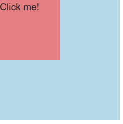

# Image Slider Examples

In the first part of the session Eng. Shimaa showed us two examples of image sliders. The first one was a simple slider that only changes the main image with the image that is clicked on. The second one was a more complex slider with next and previous buttons, and a close button. This one was more complex in JavaScript.

See the [sliders code here](https://drive.google.com/drive/u/0/folders/1mBxD2vi_M4tdVpL3a9of4ZW0pr2Uq4j6).

# Event Propagation

Event propagation is the process in which the browser determines which event handler to execute first. There are two types of event propagation: bubbling and capturing.

- **Bubbling** is the default propagation method, and it starts from the target element and bubbles up to the root element. For example if you have a parent element and a child element inside the parent element, and you click on the child element, the event will first be handled by the child element's event handler, then by the parent element's event handler.

- **Capturing** is the opposite of bubbling, and it starts from the root element and goes down to the target element. For example if you have a parent element and a child element inside the parent element, and you click on the child element, the event will first be handled by the parent element's event handler, then by the child element's event handler.

To control whether the event propagation is bubbling or capturing, you can use the `addEventListener()` method with the `useCapture` parameter. If `useCapture` is `true`, the event propagation is capturing, and if it is `false` (which is the default), the event propagation is bubbling.

Consider the following example:

HTML:

```{.html .numberLines}
<div
  id="parent"
  style="width: 200px; height: 200px; background-color: lightblue">
  <div
    id="child"
    style="width: 100px; height: 100px; background-color: lightcoral">
    Click me!
  </div>
</div>
```

JavaScript:

```{.js .numberLines}
document.getElementById('parent').addEventListener('click', function() {
  console.log('Parent clicked!');
}, true);

document.getElementById('child').addEventListener('click', function() {
  console.log('Child clicked!');
}, true);
```

This how it will look:

{width=150px}

In this example, if you click on the child element, the output will be:

```
Parent clicked!
Child clicked!
```

This is because the event propagation is capturing, and the parent element's event handler is executed first.

But if you remove the `true` parameter from the `addEventListener()` method or set it to `false` (which is the default so you don't have to write it), the output will be:

```
Child clicked!
Parent clicked!
```

## Stop Propagation

You can stop the event propagation by using the `stopPropagation()` method. This method stops the event from bubbling up or capturing down the DOM tree.

Consider the same example but with this JavaScript code:

```{.js .numberLines}
document.getElementById('parent').addEventListener('click', function() {
  console.log('Parent clicked!');
});

document.getElementById('child').addEventListener('click', function(e) {
  console.log('Child clicked!');
  e.stopPropagation();
});
```

In this example, if you click on the child element, the output will be:

```
Child clicked!
```

This is because the event propagation is stopped by the `stopPropagation()` method, and the parent element's event handler is not executed.

# Regular Expressions (Regex)

A regular expression is a sequence of characters that define a search pattern. They are used for pattern matching in strings to find or replace text and to validate text inputs like emails, phone numbers, etc so the user can only input the correct format.

That validation should be done in both front-end and the back-end to ensure the data is correct and secure. The front-end and back-end developers should agree on the regular expression pattern to use.

Regex is implemented in the front-end to validate the user input before sending it to the back-end so we can reduce the number of requests to the server to save the user time and the server resources.

When working with Regex you can use this [website](https://regex101.com/) to test your regular expression pattern to see if it matches the text you want to validate.

There is also a site called [I Hate Regex](https://ihateregex.io/) that has a collection of common regex patterns with explanations.

[This website](https://www.debuggex.com/) provides Regex visualization so you can understand your Regex better.

## Example Regular Expressions With Explanation

- `/a/` matches any string that contains the character `a`.
- `/abc/` matches any string that contains the characters `abc` in order.
- `/(a|b|c)/`, `/[abc]/`, or `/[a-c]/` match any string that contains either `a` OR `b` OR `c`.
- `/[a-z]/` matches any string that contains any lowercase letter.
- `/[A-Z]/` matches any string that contains any uppercase letter.
- `/[A-Z][a-z]/` matches any string that contains an uppercase letter followed by a lowercase letter.
- `/^[A-Z][a-z]/` matches any string that starts with an uppercase letter followed by a lowercase letter.
- `/^[A-Z][a-z]$/` matches any string that starts with an uppercase letter followed by a lowercase letter and nothing else after the lowercase letter.
- `/^[A-Z][a-z]{3}$/` matches any string that starts with an uppercase letter followed by three lowercase letters and nothing else after the lowercase letters.
- `/^[A-Z]{2}[a-z]{3}$/` matches any string that starts with two uppercase letters followed by three lowercase letters and nothing else after the lowercase letters.
- `/^[A-Z]{2,}[a-z]{3,6}$/` matches any string that starts with 2 or more uppercase letters followed by 3 to 6 lowercase letters and nothing else after the lowercase letters.
- `/[0-9]/` matches any string that contains any digit.
- `/^([0-9]|10)$/` matches any string that starts with a digit from 0 to 9 or is equal to 10.
- `/^(Mr|Mrs|Ms)?[A-Z][a-z]+$/` matches any string that starts with an optional title (Mr, Mrs, or Ms) followed by an uppercase letter followed by one or more lowercase letters.
- `/[ah-uz]/` matches any string that contains `a`, or any letter from `h` to `u`, or `z`.

## Real-World Regex Examples

- `/^((\+20)|0)1[0125][0-9]{8}$/` matches any string that starts with either `+20` or `0` followed by `1` then a digit from `0` to `2` or `5` followed by 8 digits (Egyptian phone number format).
- `/^[a-z0-9_-]{3,16}$/` Username validation (only alphanumeric characters, underscore and hyphen, between 3 and 16 characters):

## Some Characters Used in Regex

- `^`: Matches the start of a string. OR negation when used inside `[]` of a character set.
- `$`: Matches the end of a string.
- `*`: Matches zero or more of the preceding element.
- `+`: Matches one or more of the preceding element.
- `?`: Matches zero or one of the preceding element.
- `.`: Matches only one character of any type (Digit, Letter, Special Character).
- `{n}`: Matches exactly `n` of the preceding element.
- `{n,}`: Matches `n` or more of the preceding element.
- `{n,m}`: Matches between `n` and `m` of the preceding element.
- `\d`: Matches any digit character (only one character). Equivalent to `[0-9]`.
- `\D`: Matches any non-digit character (only one character). Equivalent to `[^0-9]`.
- `\w`: Matches any word character (alphanumeric character plus underscore). Equivalent to `[0-9a-zA-Z_]`.
- `\W`: Matches any non-word character. Equivalent to `[^0-9a-zA-Z_]`.
- `\s`: Matches any whitespace character. You can also just use a space character.
- `\S`: Matches any non-whitespace character.

If you want your pattern to contain any of these characters, you should escape them with a backslash `\` for example if you want to match a string that contains the `$` character you should use `/\$/`.

<!-- 
- `\b`: Matches a word boundary which is the position between a word character and a non-word character.
- `\B`: Matches a non-word boundary. -->

## Some Regex Flags

- `i`: Case-insensitive matching.
- `g`: Global matching (find all matches).
<!-- 
- `m`: Multiline matching.
- `s`: Dot matches all (including newlines).
- `u`: Unicode matching.
- `y`: Sticky matching. 
-->

## How to Use Regex

There are two ways to create a regular expression:

1. Using the `RegExp` object constructor:

```{.js .numberLines}
var re = new RegExp('pattern', 'flags');
```

2. Using the literal notation:

```{.js .numberLines}
var re = /pattern/flags;
```

Where `pattern` is the regular expression pattern, and `flags` are optional flags that can be used to change the behavior of the regular expression.

Then we can use the `test()` method to test if the pattern matches a string. The `test()` method returns `true` if the pattern matches the string, and `false` otherwise.

```{.js .numberLines}
var re = /[A-Z][a-z]{3,}/;

// true Starts with uppercase letter followed by 3 or more lowercase letters
console.log(re.test('Hello')); 

// false Starts with a lowercase letter
console.log(re.test('hello')); 

// false No lowercase letters after the uppercase letter
console.log(re.test('HELLO')); 

// false lowercase letters are less than 3
console.log(re.test('Hi'));    
```

Example using Regex with `replace()` method:

```{.js .numberLines}
var re1 = /and/ig;
var re2 = /and/i;
var re3 = /and/g;
var re4 = /and/;

var Str = 'Sand And wind'

// Replace all occurrences of 'and' with 'or'
newStr = Str.replace(re1, 'or');
console.log(newStr); // Sor or wind

// Replace the first occurrence of 'and' or 'And' with 'or'
newStr = Str.replace(re2, 'or');
console.log(newStr); // Sor And wind

// Replace all occurrences of 'and' with 'or'
newStr = Str.replace(re3, 'or');
console.log(newStr); // Sor And wind

// Replace the first occurrence of 'and' with 'or'
newStr = Str.replace(re4, 'or');
console.log(newStr); // Sor And wind
```

Using `replace()` with a Regex that has the `g` is equivalent to using the `replaceAll()` method.

## Example Regex With User Input

This is an example of how to use Regex with user input to validate an email address while the user is typing:

HTML:

```{.html .numberLines}
<input type="text" id="email" placeholder="Enter your email">
<p id="result"></p>
```

JavaScript:

```{.js .numberLines}
var email = document.getElementById('email');
var result = document.getElementById('result');

email.addEventListener('input', function() {
  var re = /^[a-zA-Z0-9._-]+@[a-zA-Z0-9.-]+\.[a-zA-Z]{2,6}$/;
  if (re.test(email.value)) {
    result.textContent = 'Valid email';
  } else {
    result.textContent = 'Invalid email';
  }
});
```

# Operators

## Conditional (Ternary) Operator

Ternary operator `condition ? value1 : value2` can be used to write an if-else statement in one line.

It returns `value1` if `condition` is true, and `value2` if `condition` is false.

```{.js .numberLines}
var a = 5;
var b = 10;
var x = (a > b) ? a : b;
```

In this example, if `a` is greater than `b`, `x` will be equal to `a`. Otherwise, `x` will be equal to `b`.

## Nullish Coalescing Operator

Nullish Coalescing Operator `??` is a new feature in JavaScript that allows you to provide a default value for a variable if the variable is `null` or `undefined`. If the variable is `null` or `undefined`, the result will be the default value. Otherwise, the result will be the variable itself.

```{.js .numberLines}
var x = y ?? z;
```

In this line of code, if `y` is `null` or `undefined`, `x` will be `z`. If `y` is not `null` or `undefined`, `x` will be `y`.

This is useful because it allows you to provide a default value for a variable without having to check if the variable is `null` or `undefined`.

Without the nullish coalescing operator, you would have to do something like this:

```{.js .numberLines}
var x = (y !== null && y !== undefined) ? y : z;
```

## Chaining Operator

**Chaining Operator** or **Safe Navigation Operator** `?.` is a new feature in JavaScript that allows you to access a property of an object that may be `null` or `undefined` without causing an error. If the property is `null` or `undefined`, the result will be `undefined`. Otherwise, the result will be the property itself.

```{.js .numberLines}
var x = obj?.prop;
```

In this line of code, if `obj` is `null` or `undefined`, `x` will be `undefined` and no error will be thrown. If `obj` is not `null` or `undefined`, `x` will be equal to `obj.prop`.

This is useful because it eliminates the need to check each object in the chain to avoid a `TypeError` being thrown when trying to access a property of `null` or `undefined`.

Without the safe navigation operator, you would have to do something like this:

```{.js .numberLines}
var x = (obj !== null && obj !== undefined) ? obj.prop : undefined;
```

As you can see, the safe navigation operator makes the code cleaner and easier to read.

# Extras

- `is-valid` and `is-invalid` classes in Bootstrap can be used to style the input fields based on the validation result.
- To access the next sibling of an element you can use the `nextElementSibling` property.

\pagebreak

# Summary

In this session we have covered the following topics:

- We learned about image sliders and how to create them using JavaScript.
- Event propagation is the process in which the browser determines which event handler to execute first. There are two types of event propagation: bubbling and capturing.
- We can stop the event propagation by using the `stopPropagation()` method.
- Regular expressions (Regex) are used for pattern matching in strings to find or replace text and to validate text inputs.
- We learned about some common regex patterns and how to use regex in JavaScript.
- Conditional (Ternary) Operator `condition ? value1 : value2` can be used to write an if-else statement in one line.
- Nullish Coalescing Operator `??` allows you to provide a default value for a variable if the variable is `null` or `undefined`.
- Chaining Operator `?.` allows you to access a property of an object that may be `null` or `undefined` without causing an error.
- `is-valid` and `is-invalid` classes in Bootstrap can be used to style the input fields based on the validation result.
- To access the next sibling of an element you can use the `nextElementSibling` property.
