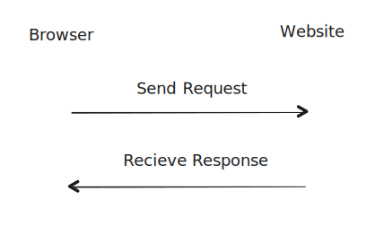

# `innerHTML` and `innerText`

## `innerHTML`

- `innerHTML` returns the HTML content of an element.
- When assigning a value with HTML tags to `innerHTML`, the browser will render the HTML tags as HTML elements.
- When printing the value of `innerHTML` of an element that contains HTML tags, the browser will show the HTML tags in the output.

Example:

HTML:

```{.html .numberLines}
<p id="example">My <strong>example</strong> paragraph</p>
```

JavaScript:

```{.js .numberLines}
var example = document.getElementById('example');
console.log(example.innerHTML); // My <strong>example</strong> paragraph

example.innerHTML = 'My <strong>new</strong> paragraph';
console.log(example.innerHTML); // My <strong>new</strong> paragraph
```

## `innerText`

- `innerText` returns the text content of an element.
- When assigning a value with HTML tags to `innerText`, the browser will render the HTML tags as plain text.
- When printing the value of `innerText` of an element that contains HTML tags, the browser will show the HTML tags in the output.

Example:

HTML:

```{.html .numberLines}
<p id="example">My <strong>example</strong> paragraph</p>
```

JavaScript:

```{.js .numberLines}
var example = document.getElementById('example');
console.log(example.innerText); // My example paragraph

example.innerText = 'My <strong>new</strong> paragraph';
console.log(example.innerText); // My <strong>new</strong> paragraph
```

Here the `<strong>new</strong>` appear in the web page as it is because `innerText` does not render HTML tags.

# Creating Elements

To create an element, you can use the `document.createElement()` method. This method creates a new element with the specified tag name.

Example:

```{.js .numberLines}
var newElement = document.createElement('div');
```

To set the attributes of the new element, you can use the `setAttribute()` method or the `.` notation.

Example:

```{.js .numberLines}
// Using the setAttribute() method
newElement.setAttribute('id', 'new-element');
newElement.setAttribute('class', 'new-class');

// Or using the . notation
newElement.id = 'new-element';
newElement.className = 'new-class';
```

## Appending & Prepending Elements (Child)

To append an element inside another element in the DOM, you can use the `append()` method, and to prepend an element, you can use the `prepend()` method.

Example:

HTML:

```{.html .numberLines}
<div id="parent" style="background-color: gold">
  <p>First paragraph</p>
  <p>Second paragraph</p>
</div>
```

JavaScript:

```{.js .numberLines}
var parent = document.getElementById('parent');
var newElement = document.createElement('p');
newElement.innerText = 'New paragraph';

// Append the new element inside the parent element
parent.append(newElement);
```

Now the result will look like this:

{width=300px}

## Add Element Before or After Another (Sibling)

To add an element before or after another element in the DOM, you can use the `before()` and `after()` methods.

Example:

HTML:

```{.html .numberLines}
<div id="parent" style="background-color: gold">
  <p>First paragraph</p>
  <p>Second paragraph</p>
</div>
```

JavaScript:

```{.js .numberLines}
var parent = document.getElementById('parent');
var newElement = document.createElement('p');
newElement.innerText = 'New paragraph';

// Add the new element after the second paragraph
parent.after(newElement);
```

Now the result will look like this:

{width=300px}

<!-- What is the difference between append and appendChild -->

\begin{box4}{Note}

You can only send elements as arguments to the \texttt{append()}, \texttt{prepend()}, \texttt{before()}, and \texttt{after()} methods. If you send HTML tag or text, it will be treated as a string and not as an element.

\end{box4}

# Traversing the DOM

Traversing the DOM which is a way to move around the DOM tree and select elements based on their relationship to other elements.

Some useful properties and methods for traversing the DOM are:

1. `parentElement`: returns the parent **element** of an element.
2. `parentNode`: returns the parent **node** of an element.
3. `firstElementChild`: returns the first child **element** of an element.
4. `lastElementChild`: returns the last child **element** of an element.
5. `children`: returns an **HTML collection** of an element's child elements.
6. `childNodes`: returns a **NodeList** of an element's child nodes.
7. `nextElementSibling`: returns the next sibling **element** of an element.
8. `previousElementSibling`: returns the previous sibling **element** of an element.
9. `nextSibling`: returns the next sibling **node** of an element.
10. `previousSibling`: returns the previous sibling **node** of an element.

Example:

HTML:

```{.html .numberLines}
<div id="parent" style="background-color: gold">
  <p id="p1">First paragraph</p>
  <p>Second paragraph</p>
</div>
```

JavaScript:

```{.js .numberLines}
var parent = document.getElementById('parent');
var p1 = document.getElementById('p1');

// Get the parent element of the first paragraph
var parentElement = p1.parentElement;
console.log(parentElement.id); // parent

// Get the parent node of the first paragraph
var parentNode = p1.parentNode;
console.log(parentNode.id); // parent

// Get the first child of the parent element
var firstChild = parent.firstElementChild;
console.log(firstChild.innerText); // First paragraph

// Get the last child of the parent element
var lastChild = parent.lastElementChild;
console.log(lastChild.innerText); // Second paragraph

// Get all the child elements of the parent element
var children = parent.children;
console.log(children.length); // 2
console.log(children[1]); // <p>Second paragraph</p>

// Get all the child nodes of the parent element
var childNodes = parent.childNodes;
console.log(childNodes.length); // 3
console.log(childNodes[1]); // #text

// Get the next sibling element of the first paragraph
var nextSibling = p1.nextElementSibling;
console.log(nextSibling.innerText); // Second paragraph

// Get the previous sibling element of the second paragraph
var previousSibling = lastChild.previousElementSibling;
console.log(previousSibling.innerText); // First paragraph

// Get the next sibling node of the first paragraph
var nextNode = p1.nextSibling;
console.log(nextNode); // #text

// Get the previous sibling node of the second paragraph
var previousNode = lastChild.previousSibling;
console.log(previousNode); // #text
```

# Important Differences

## `previousSibling`, `nextSibling` VS `previousElementSibling`, `nextElementSibling`

- `previousSibling` and `nextSibling` return nodes and these nodes include both element nodes and non-element nodes (like text and comment nodes).
- `previousElementSibling` and `nextElementSibling` return only element nodes and ignore text and comment nodes.

```{.html .numberLines}
<div>
  <p>Paragraph 1</p>
  Text
  <p>Paragraph 2</p>
</div>
```

If the current node is the first `<p>` element, `nextSibling` would return the text node `Text`, while `nextElementSibling` would return the second `<p>` element.

## NodeList VS HTML Collection

| NodeList                                                   | HTML Collection                                             |
| ---------------------------------------------------------- | ----------------------------------------------------------- |
| Static (Does not update when the DOM changes)              | Live (Updates when the DOM changes)                         |
| Returns a list of nodes                                    | Returns a list of elements                                  |
| Nodes can be of any type like element, text, comment, etc. | Elements only                                               |
| Returned by methods like `querySelectorAll`, `childNodes`  | Returned by methods like `getElementsByTagName`, `children` |

By saying that the `NodeList` is static, it means that if you add an element to the DOM after getting the `NodeList`, the `NodeList` will not include the new element. On the other hand, the `HTML Collection` is live, which means that it will include the new element even after getting the `HTML Collection`.

Example:

HTML:

```{.html .numberLines}
<div>
  <p>Paragraph 1</p>
  <p>Paragraph 2</p>
</div>
```

JavaScript:

```{.js .numberLines}
var div = document.querySelector('div');
var paragraphsCollection = div.getElementsByTagName('p');
var paragraphsNodeList = div.querySelectorAll('p');

console.log(paragraphsCollection.length); // 2
console.log(paragraphsNodeList.length);   // 2

var newParagraph = document.createElement('p');
newParagraph.innerText = 'New paragraph';

div.append(newParagraph);

console.log(paragraphsCollection.length); // 3
console.log(paragraphsNodeList.length);   // 2
```

In this example, the `paragraphsCollection` will have a length of 3, while the `paragraphsNodeList` will have a length of 2 because the `NodeList` is static and does not change when the DOM changes while the `HTML Collection` is live and changes when the DOM changes.

# Browser Object Model (BOM)

Browser Object Model or BOM is a set of objects provided by the browser to interact with the browser itself.

## DOM VS BOM

The DOM can be accessed via the BOM through the `window.document` property. So, you can say that the DOM is part of the BOM in a browser environment.

`window` is a super global object in the browser environment.

DOM is concerned with the content of the web document, while the BOM is concerned with the browser environment.

## BOM Methods & Properties

Some of the BOM methods include:

### `setInterval`

`setInterval()`: Calls a function or evaluates an expression each time a specified number of milliseconds elapses.

For example, to display the value of a counter every second:

```{.js .numberLines}
function incrementCounter() {
  console.log(counter);
  counter++;
}

var counter = 0;
var interval = setInterval(incrementCounter, 1000);
```

### `clearInterval`

`clearInterval()`: Stops the intervals set by `setInterval()`.

For example, to stop the counter we made earlier when the user clicks a button:

```{.js .numberLines}
var button = document.getElementById('stop');

button.addEventListener('click', function() {
  console.log("Counter stopped");
  clearInterval(interval);
});
```

### `setTimeout`

`setTimeout()`: Calls a function or evaluates an expression **once** after a specified number of milliseconds.

For example, to display a message after 3 seconds:

```{.js .numberLines}
function showMessage() {
  console.log("Hello, world!");
}

setTimeout(showMessage, 3000);
```

### `alert`

`alert()`: Displays an alert box with a message and an OK button.

For example:

```{.js .numberLines}
alert("Hello, world!");
```

### `open`

`open()`: Opens a new browser window or a new tab.

For example, This will open a new tab with Google's homepage.

```{.js .numberLines}
var googleBtn = document.getElementById('open');
googleBtn.addEventListener('click', function() {
  open('https://www.google.com', '_blank');
});
```

`_blank` is the name of the target window. It specifies that the URL should be opened in a new tab and it's the default value. To open the URL in the same tab, you can use `_self`.

`open` also has other parameters like `width`, `height`, `top`, `left`, etc.

```{.js .numberLines}
open('https://www.google.com', '_blank', 'width=500,height=500,top=100,left=100');
```

Notice that `width`, `height`, `top`, and `left` are passed as a string with a comma separating them.

`open` is also one of `window`'s methods, so you can use it in the form `window.open()`.

### `close`

`close()`: Closes the current window.

For example, to close the current window when the user clicks a button:

```{.js .numberLines}
var closeBtn = document.getElementById('close');
closeBtn.addEventListener('click', function() {
  close();
});
```

### `innerWidth` and `innerHeight`

`innerWidth` and `innerHeight` properties return the width and height of the content area of the browser window.

If you resize the browser window, the values of `innerWidth` and `innerHeight` will change accordingly.

```{.js .numberLines}
console.log(window.innerWidth);
console.log(window.innerHeight);
```

### `screen` Object

The `screen` object provides information about the user's screen.

Some of the properties of the `screen` object include:

- `screen.width`: Returns the width of the screen.
- `screen.height`: Returns the height of the screen.
<!-- - `screen.availWidth`: Returns the width of the screen excluding the taskbar.
- `screen.availHeight`: Returns the height of the screen excluding the taskbar. -->

Those properties don't change when you resize the browser window because they are related to the user's screen (the hardware) and not the browser window.

```{.js .numberLines}
console.log(screen.width);
console.log(screen.height);
```

`screen` object also has other properties like `availWidth`, `availHeight`.

These are the areas of the screen that you can use to display content, it doesn't include the taskbar or any other system-related areas.

```{.js .numberLines}
console.log(screen.availWidth);
console.log(screen.availHeight);
```

## `location` Object

The `location` object contains information about the current URL.

Some of the properties of the `location` object include:

- `location.href`: Returns the entire URL.
- `location.hostname`: Returns the domain name of the web host.
- `location.pathname`: Returns the path and filename of the current page.
- `location.history`: Returns the history of the current page.
  - `location.history.back()`: Goes back to the previous page.
  - `location.history.forward()`: Goes forward to the next page.

# API

API (Application Programming Interface) is universal way for different software applications to communicate with each other.

APIs can be used to **recieve** data from a server, **send** data to a server, **modify** data on a server, and **delete** data from a server.

The API comes in the form of a URL that you can send a request to and get a response from.

{width=270px}

When dealing with APIs the front-end developer takes the API from the back-end developer with the documentation of how to use it. [Example API documentation](https://forkify-api.herokuapp.com/).

Then the front-end developer uses the API to get the data needed to display on the web page.

A good way to test an APIs is to use a tool like [Postman](https://www.postman.com/), which is a collaboration platform for API development.

## JSON

When you get a response from an API, it's usually in the form of JSON (JavaScript Object Notation).

JSON objects are easy to read and write. They are human-readable and can be parsed by JavaScript. JSON objects are written in key/value pairs and can be either an object or an array of objects.

Example of a JSON object:

```{.json .numberLines}
{
  "name": "Mohamed",
  "age": 30,
  "city": "Cairo"
}
```

## Free APIs

There are many free APIs available that you can use to practice working with APIs.

Example Free APIs:

- [JSONPlaceholder](https://jsonplaceholder.typicode.com/)
- [Forkify Meals API](https://forkify-api.herokuapp.com/)
- [Random User Generator API](https://randomuser.me/documentation)
- [Weather API](https://www.weatherapi.com/)
- [News API](https://newsapi.org/)
- [MovieDB API](https://www.themoviedb.org/documentation/api)
- [Fake Store API](https://fakestoreapi.com/)

You can find many more on [this `public-apis` GitHub repo](https://github.com/public-apis/public-apis).

## Terms Related to APIs

There is some terms related to APIs:

Lets use this API to explain the terms: `https://api.github.com/users/Microsoft`

- **Base URL**: The main URL of the API. For example, `https://api.github.com/`
- **Endpoint**: The part of the URL after the base URL that specifies a particular resource or collection of resources. For example, `/users/Microsoft` is the endpoint in the URL `https://api.github.com/users/Microsoft`.
- **Request**: The action you want the API to perform. In this case, a `GET` request to `https://api.github.com/users/Microsoft` to retrieve the data of the user `Microsoft`.
- **Response**: The data you get back from the API. This is typically in the form of a JSON object or array.
- **Status Code**: A number returned by the server that indicates the result of the request. For example, 200 means the request was successful, while 404 means the requested resource could not be found.
- **Method**: The type of request you are making. Common methods include `GET`, `POST`, `PUT`, `DELETE`, and `PATCH`.
  - `GET`: To get data from the server.
  - `POST`: To send data to the server.
  - `PUT`: To update data on the server.
  - `DELETE`: To delete data on the server.
  - `PATCH`: To partially update data on the server.
  - `PUT`: To update data on the server.

## How to Use an API

To use an API, you need to know about AJAX (Asynchronous JavaScript and XML) first.

AJAX allows you to send and receive data from a server asynchronously without reloading the page.

You can use the `XMLHttpRequest` object to interact with the server and get data from it. We don't use the object directly, but we create a `new` instance of it and use its methods.

Example of creating an instance of `XMLHttpRequest`:

```{.js .numberLines}
var xhr = new XMLHttpRequest();
```

Then you can use the `open()` method to establish a connection with the server by specifying the request **method** and the **API URL**.

```{.js .numberLines}
xhr.open('METHOD', 'API_URL');
```

For example to establish a connection with the forkify API using the `GET` method:

```{.js .numberLines}
xhr.open('GET', 'https://forkify-api.herokuapp.com/api/search?q=pizza');
```

After opening the connection, you can use the `send()` method to send the request to the server.

```{.js .numberLines}
xhr.send();
```

To handle the response from the server, you can use the `onload` event handler.

```{.js .numberLines}
xhr.addEventListener('load', function() {
  console.log(xhr.response);
});
```

The `response` property of the `XMLHttpRequest` object contains the response data from the server as a **string**, so you need to parse it to a JSON object.

```{.js .numberLines}
xhr.addEventListener('load', function() {
  var data = JSON.parse(xhr.response);
  console.log(data);
});
```

Now you can access the data returned by the API.

```{.js .numberLines}
xhr.addEventListener('load', function() {
  var data = JSON.parse(xhr.response);
  console.log(data.recipes);
});
```

You can also use `readystatechange` event handler to check the status of the request before accessing the data.

```{.js .numberLines}
xhr.addEventListener('readystatechange', function() {
  if (xhr.readyState === 4 && xhr.status === 200) {
    var data = JSON.parse(xhr.response);
    console.log(data.recipes);
  }
});
```

::: {.columns .ragged columngap=2.5em column-rule="0.0pt solid black"}

`readyState` values are:

- `0`: request not initialized
- `1`: server connection established
- `2`: request sent
- `3`: processing request
- `4`: request finished and response is ready

\columnbreak

`status` values are:

- `200`: OK (request successful)
- `403`: Forbidden (access denied)
- `404`: Not Found (resource not found)
- `500`: Internal Server Error
:::

Here is the complete code to get data from the forkify API:

```{.js .numberLines}
var xhr = new XMLHttpRequest();
xhr.open('GET', 'https://forkify-api.herokuapp.com/api/search?q=pizza');
xhr.send();

xhr.addEventListener('load', function() {
  if (xhr.readyState === 4 && xhr.status === 200) {
    var data = JSON.parse(xhr.response);
    console.log(data.recipes);
  }
});
```

We also have `error` event handler to handle errors when the request fails.

```{.js .numberLines}
xhr.addEventListener('error', function() {
  console.log('An error occurred');
});
```

## Displaying Data from an API

This is an example of how to display data from an API on a web page.

HTML:

```{.html .numberLines}
<div class="container">
  <div class="row" id="rowBody"></div>
</div>
```

JavaScript:

```{.js .numberLines}
var xhr = new XMLHttpRequest();
var allRecipies = [];
xhr.open("get", "https://forkify-api.herokuapp.com/api/search?q=pizza");
xhr.send();
xhr.addEventListener("readystatechange", function () {
  if (xhr.readyState == 4 && xhr.status == 200) {
    allRecipies = JSON.parse(xhr.response).recipes;
    display();
  }
});

function display() {
  var content = ``;
  for (var i = 0; i < allRecipies.length; i++) {
    content += `
      <div class="col-md-4">
        
        <h3>${allRecipies[i].title}</h3>
        <p>${allRecipies[i].publisher}</p>
      </div>`;
  }
  document.getElementById("rowBody").innerHTML = content;
}
```

\pagebreak

# Summary

- `innerHTML` returns the HTML content of an element, while `innerText` returns the text content of an element.
- When assigning a value with HTML tags to `innerHTML`, the browser will render the HTML tags as HTML elements.
- When assigning a value with HTML tags to `innerText`, the browser will render the HTML tags as plain text.
- To create an element, you can use the `document.createElement()` method.
- To append an element inside another element in the DOM, you can use the `append()` method, and to prepend an element, you can use the `prepend()` method.
- To add an element before or after another element in the DOM, you can use the `before()` and `after()` methods.
- Traversing the DOM is a way to move around the DOM tree and select elements based on their relationship to other elements.
- `previousSibling` and `nextSibling` return nodes and include both element nodes and non-element nodes, while `previousElementSibling` and `nextElementSibling` return only element nodes.
- The Browser Object Model (BOM) is a set of objects provided by the browser to interact with the browser itself.
- Some of the BOM methods include `setInterval`, `clearInterval`, `setTimeout`, `alert`, `open`, and `close`.
- The `screen` object provides information about the user's screen, and the `location` object contains information about the current URL.
- APIs (Application Programming Interfaces) are used to communicate between different software applications.
- JSON (JavaScript Object Notation) is a common format for data exchange in APIs.
- To use an API, you need to know about AJAX (Asynchronous JavaScript and XML).
- You can use the `XMLHttpRequest` object to interact with the server and get data from it.
- To display data from an API on a web page, you can create an instance of `XMLHttpRequest`, send a request to the API, and handle the response to access the data.
- Common HTTP methods include `GET`, `POST`, `PUT`, `DELETE`, and `PATCH`.
- The `readyState` property of the `XMLHttpRequest` object indicates the state of the request, and the `status` property indicates the status of the response.
  - `readyState` values: `0`, `1`, `2`, `3`, `4`
  - `status` values: `200`, `403`, `404`, `500`
