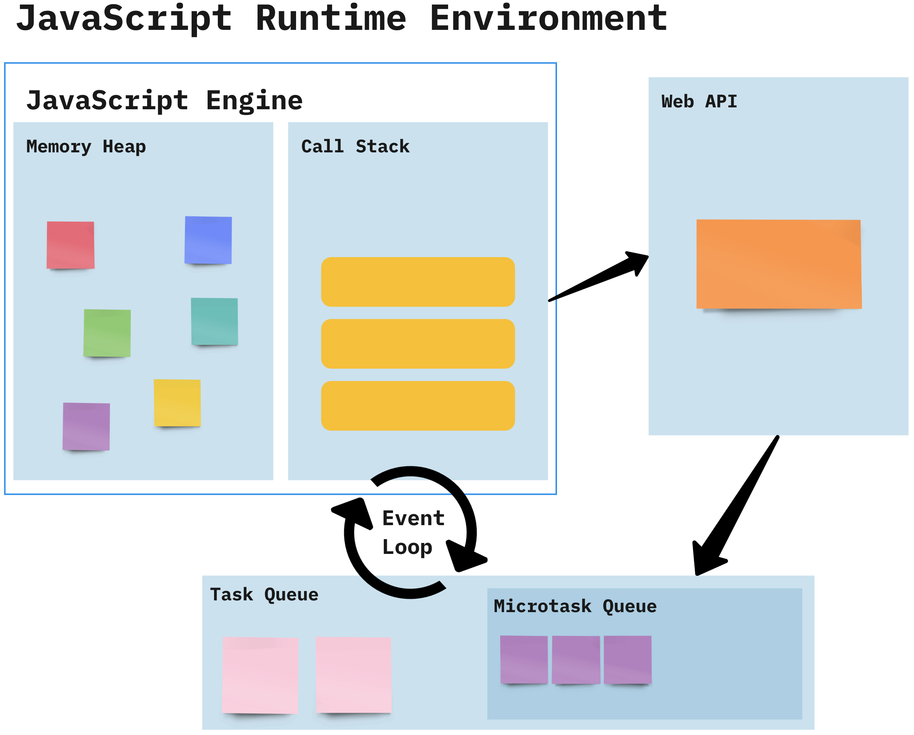

<!--
- Navbar with navitem for each item to search for via the API
- Search bar
- Loading screen with css spinners
- CSS Spinners website
-->

# Synchrounous & Asynchronous

A synchronous operation is one that blocks the execution of other code until it is finished, this is also known as **blocking** code.

An asynchronous operation is one that does not block the execution of other code, instead, it allows other code to continue executing while it waits for the operation to complete, this is known as **non-blocking** code.

::: {.columns .ragged columngap=1em column-rule="0.0pt solid black"}

Example of synchronous code:

```{.js .numberLines #exec}
console.log('1'); // synchronous
console.log('2'); // synchronous
console.log('3'); // synchronous
```

\columnbreak

Example of asynchronous code:

```{.js .numberLines #exec}
console.log('1'); // synchronous
setTimeout(function () { // asynchronous
  console.log("2");
}, 1000);
console.log('3'); // synchronous
```

:::

In the case of this code example, the `setTimeout` function is an example of an asynchronous operation. It tells the browser to wait for a certain amount of time before executing the callback function. While the browser is waiting, it can continue executing other code, that is why the output of the code is `1`, `3`, and `2`.

To understand the difference and why the output is different, we need to understand how JavaScript works.

## How JavaScript Works

JavaScript is a **non-blocking single-threaded** language. This means that it can only execute one piece of code at a time. Some other languages like Java are **multi-threaded**, which means that they can execute multiple pieces of code at the same time.

JavaScript runtime environment has the following components:

- **Execution stack (Call Stack)**: where code is executed. It has the synchronous methods and global variables
- **Callback queue (Task Queue)**: where asynchronous tasks are placed
- **Web API**: a set of functions provided by the browser to handle long-running tasks that would take a long time to execute
- **Event loop**: checks if there are any tasks in the callback queue

When JavaScript code is executed, it is added to the **execution stack**. The execution stack is a data structure that keeps track of the execution of the code. When a function is called, it is added to the call stack. When the function finishes executing, it is removed from the call stack.

Both **execution stack** and **web API** work at the same time to execute the code.

Synchrounous code gets executed directly in the call stack.

When JavaScript encounters an asynchronous operation, like a `setTimeout` function, it does not execute the code immediately (which means adding it to the call stack), instead, it hands off the operation to the **web API** provided by the browser. The web API handles the operation in the background and when it is finished, it adds the result to the **task queue** then the **event loop** checks if there are any tasks in the task queue and if there are, it adds them to the call stack, but **only when the call stack is empty**.

The **task queue** tasks are divided into two categories:

- **Microtasks**: tasks that have high priority and have the functions that return promises, or uses `await`, `async`.
- **Macrotasks**: tasks like `setTimeout`, `setInterval`.

Microtasks have higher priority than macrotasks, so they are executed first.

This diagram demonstrates what each component of the JavaScript runtime environment takes care of:

```{.mermaid caption="JavaScript Runtime Environment"}
mindmap
[JS Runtime Env]
  (Execution Stack)
    (Execution of code)
    (Synchrounous Methods)
    (Global Variables)
  (Callback Queue)
    (Microtasks)
      (Promises)
      (async/await)
    (Macrotasks)
      (setTimeout)
      (setInterval)
  (WebAPI)
    (Async code and methods like setTimeout)
  (Event Loop)
    (Checks if CallStack is empty to add tasks from Callback Queue)
```

\pagebreak

This image demonstrates the steps of the process:

{width=450px}

# Control Code Execution Flow

Sometimes we need to control the flow of the code execution, for example, when we need to execute a piece of code after another because it depends on the result of the first one.

That is when we use **callbacks**, **promises**, and **async/await**.

## Callbacks

A callback is a function that is passed as an argument to another function. The function that receives the callback function will execute first then it will call the callback function.

```{.js .numberLines}
function first(callback) {
  console.log('First function');
  callback();
}

function second(callback) {
  console.log('Second function');
  callback();
}

function third() {
  console.log('Third function');
}

first(function () {
  second(function () {
    third();
  });
});
```

This is how the code will be executed:

1. The `first` function is called and it logs `First function`.
2. Then it calls the callback function which is the `second` function.
3. The `second` function is called and it logs `Second function`.
4. Then it calls the callback function which is the `third` function.
5. The `third` function is called and it logs `Third function`.

In this code, the callback functions are wrapped in anonymous functions because if we passed the callbacks with arguments directly (like `first(second(third))`), the functions will be executed immediately.

Applying callbacks to the first example:

```{.js .numberLines}
function first(callback) {
  console.log('1');
  callback();
}

function second(callback) {
  setTimeout(function () {
    console.log('2');
    callback();
  }, 1000);
}

function third() {
  console.log('3');
}

first(function () {
  second(function () {
    third();
  });
});
```

Now the functions will be executed in order and the output will be `1`, `2`, `3` just as we want.

We can also check if the callback function exists before calling it so we don't call it if it doesn't exist.

```{.js .numberLines}
function first(callback) {
  console.log('1');
  if (callback) {
    callback();
  }
}
```

### Callback Hell

As you can see from the code examples when we have a lot of nested callbacks, the code becomes hard to read and maintain, this is known as **Callback Hell**.

For this reason, callback functions are not used a lot instead we use **promises** and **async/await**.

## Promise

A promise is an object that represents the eventual completion or failure of an asynchronous operation and its resulting value.

A promise has three states:

- **Pending**: the initial state, neither fulfilled nor rejected.
- **Fulfilled (resolved)**: the operation completed successfully. Used with `.then()` method.
- **Rejected**: the operation failed. Used with `.catch()` method.

A promise is created using the `Promise` constructor:
  
```{.js .numberLines}
var promise = new Promise(function (resolve, reject) {
  // code here
});
```

The `Promise` constructor takes a function as an argument that has two parameters `resolve` and `reject`. These parameters are functions that are used to resolve or reject the promise.

```{.js .numberLines}
var promise = new Promise(function (resolve, reject) {
  setTimeout(function () {
    resolve('Success');
  }, 1000);
});

promise.then(function (value) {
  console.log(value);
});
```

In this example, the promise will be resolved after 1 second and the `then` method will be called with the value `Success`.

If the promise is rejected, the `catch` method will be called:

```{.js .numberLines}
var promise = new Promise(function (resolve, reject) {
  setTimeout(function () {
    reject('Error');
  }, 1000);
});

promise.then(function (value) {
  console.log(value);
}).catch(function (error) {
  console.error(error);
});
```

The value of `error` and `value` parameters are the values passed to the `resolve` and `reject` functions, so in our case `value = 'Success'` and `error = 'Error'`.

In this example, the promise will be rejected after 1 second and the `catch` method will be called with the error `Error`.

\begin{box4}{Note:}
To be able to use \texttt{.then()} when calling a function the function must return a promise, and the promise must be resolved.
\end{box4}

<!-- ### Promise.all

`Promise.all` is a method that takes an array of promises and returns a single promise that resolves when all the promises in the array have resolved.

```{.js .numberLines}
var promise1 = new Promise(function (resolve, reject) {
  setTimeout(function () {
    resolve('Promise 1');
  }, 1000);
});

var promise2 = new Promise(function (resolve, reject) {
  setTimeout(function () {
    resolve('Promise 2');
  }, 2000);
});

Promise.all([promise1, promise2]).then(function (values) {
  console.log(values);
});
```

In this example, the `Promise.all` method will resolve after 2 seconds and the `then` method will be called with the values `['Promise 1', 'Promise 2']`.
 -->

### Promise Chaining

Promises can be chained together to execute code in a specific order.

```{.js .numberLines #exec}
function one(param1) {
  return new Promise(function(resolve, reject) {
    // Do something with param1
    // Resolve or reject based on the result
    resolve('Function One processed ' + param1);
  });
}

function two(param2) {
  return new Promise(function(resolve, reject) {
    // Do something with param2
    // Resolve or reject based on the result
    resolve('Function Two processed ' + param2);
  });
}

function three(param3) {
  return new Promise(function(resolve, reject) {
    // Do something with param3
    // Resolve or reject based on the result
    reject('Function Three encountered an error with ' + param3);
  });
}

one('input1')
  .then(function(result1) {
    console.log(result1);
    return two('input2');
  })
  .then(function(result2) {
    console.log(result2);
    return three('input3');
  })
  .then(function(result3) {
    console.log(result3);
  })
  .catch(function(error) {
    console.error('Error:', error);
  });
```

This is how the code will be executed:

```{.mermaid caption="Promise Chaining" width=500px}
sequenceDiagram
    participant GlobalScope
    participant one
    participant two
    participant three
    participant Console

    GlobalScope->>one: Call with 'input1'
    one-->>one: Process 'input1'
    one-->>GlobalScope: Resolve Promise
    GlobalScope->>Console: Log result1 (Function One processed input1)
    GlobalScope->>two: Call with 'input2'
    two-->>two: Process 'input2'
    two-->>GlobalScope: Resolve Promise
    GlobalScope->>Console: Log result2 (Function Two processed input2)
    GlobalScope->>three: Call with 'input3'
    three-->>three: Process 'input3'
    three-->>GlobalScope: Reject Promise
    GlobalScope->>Console: Log error (Function Three encountered an error with input3)
```

1. The `one` function is called with the parameter `'input1'`. This function returns a new Promise. Inside this Promise, some processing is done with `'input1'`, and then the Promise is resolved with a message indicating that `'input1'` has been processed.
2. The `then` method is called on the Promise returned by the `one` function. This `then` method takes a function as an argument, which will be executed when the Promise is resolved. The result of the `one` function (the resolve message) is logged to the console.
3. After the first `then` method has finished executing, it returns a new Promise by calling the `two` function with the parameter `'input2'`. Similar to the `one` function, the `two` function does some processing with `'input2'` and then resolves the Promise with a message.
4. The next `then` method is called on the Promise returned by the `two` function. Again, this `then` method takes a function as an argument, which logs the result of the `two` function to the console.
5. After the second `then` method has finished executing, it returns a new Promise by calling the `three` function with the parameter `'input3'`. However, this time, the Promise is rejected with an error message instead of being resolved.
6. Because the Promise from the `three` function was rejected, the next `then` method is skipped, and the `catch` method is called instead. The `catch` method also takes a function as an argument, which logs the error message to the console.

\begin{box4}{Note:}

If the promise in the chain is rejected, the next \texttt{then} method is skipped, and the \texttt{catch} method is called instead.

\tcblower

We can use \texttt{.catch()} method with the \texttt{error} event listener when calling an API so if the API call fails, the promise will be rejected and the \texttt{catch} method will be called.

\end{box4}

We also have the `finally` method that is called at the end of the promise chain and is called regardless of whether the promise is resolved or rejected.

```{.js .numberLines}
promise.then(function (value) {
  console.log(value);
}).catch(function (error) {
  console.error(error);
}).finally(function () {
  console.log('Finally');
});
```

The Promise way of controlling the flow of the code execution can be hard to read and maintain when we have a lot of promises, that is why we have **async/await**.

## Async/Await

Async/await is a new way to write asynchronous code in JavaScript. It is built on top of promises and provides a more readable and maintainable way to write asynchronous code. But before we dive into async/await, we need to know the `fetch` API.

### Fetch API

The `fetch` API is a modern replacement for the `XMLHttpRequest` object. It is used to make network requests to a server and is built into the browser.

The `fetch` function takes a URL as an argument and **returns a promise** that resolves to the `Response` object representing the response to the request.

The `fetch` function have a `GET` method by default, but we can specify the method using the `method` option.

Syntax:

```{.js .numberLines}
fetch(API_URL, options)
  .then(function (response) {
    // Do something with the response
  })
  .catch(function (error) {
    // Handle any errors
  });
```

The `options` object is a JSON object that contains the configuration for the request. Some of the options are:

- `method`: the HTTP method to use for the request (e.g., `GET`, `POST`, `PUT`, `DELETE`).
- `headers`: an object containing the headers to include in the request.
- `body`: the body of the request (e.g., JSON data).

Example:

```{.js .numberLines}
fetch("https://jsonplaceholder.typicode.com/posts/1", {
  method: "GET", // Default value you don't have to specify it
})
  .then(function (response) {
    return response.json();
  })
  .then(function (data) {
    console.log(data);
  })
  .catch(function (error) {
    console.error(error);
  });
```

This is how the code will be executed:

1. `fetch("https://jsonplaceholder.typicode.com/posts/1", { method: "GET" })`: This line sends a GET request to the specified URL. The `fetch` function returns a Promise that resolves to the Response object representing the response to the request.
2. `.then(function (response) { return response.json(); })`: This is a Promise chain. When the Promise from the `fetch` function resolves, it passes the Response object to this function. The `response.json()` method reads the response body and returns another Promise that resolves with the result of parsing the body text as JSON.
3. `.then(function (data) { console.log(data); })`: This is another link in the Promise chain. When the Promise from the `response.json()` method resolves, it passes the parsed JSON data to this function, which logs the data to the console.
4. `.catch(function (error) { console.error(error); })`: This is the error handling part of the Promise chain. If any of the Promises in the chain reject (i.e., an error occurs), this function will be called with the error as its argument. It logs the error to the console.

<!-- The following two examples are equivalent, the first one uses `XMLHttpRequest` and the second one uses `fetch`.

::: {.columns .ragged columngap=2.5em column-rule="0.0pt solid black"}

```{.js .numberLines}
var xhr = new XMLHttpRequest();
xhr.open("GET", "https://jsonplaceholder.typicode.com/posts/1", true);
xhr.onreadystatechange = function () {
  if (xhr.readyState === 4 && xhr.status === 200) {
    console.log(JSON.parse(xhr.responseText));
  }
};
xhr.send();
```

\columnbreak

```{.js .numberLines}
fetch("https://jsonplaceholder.typicode.com/posts/1")
  .then(function (response) {
    return response.json();
  })
  .then(function (data) {
    console.log(data);
  })
  .catch(function (error) {
    console.error(error);
  });
```

::: -->

But that is still hard to read and unclear, that is why we have **async/await**.

### Using Async/Await

The `async` and `await` keywords were introduced in ES8 (ECMAScript 2017) to make asynchronous code easier to read and write.

The `async` keyword is used to define an asynchronous function, which returns a promise. The `await` keyword is used to pause the execution of an asynchronous function until a promise is resolved.

```{.js .numberLines}
async function fetchData() {
  var response = await fetch("https://jsonplaceholder.typicode.com/posts/1");
  var data = await response.json();
  console.log(data);
}

fetchData();
```

This is how the code will be executed:

1. `fetchData()`: Calls the function. `fetchData` returns a promise because it is an asynchronous function.
2. `await fetch(...)`: Sends a request and `await` pauses the function until the promise returned by `fetch` is resolved.
3. `await response.json()`: reads the response body and waits for the parsing of the body text as JSON.

\begin{box4}{Note:}

If you remove the \texttt{await} keyword from any of the lines then log the \texttt{response} or \texttt{data} variables, you will get \texttt{Promise{<pending>}} because the \texttt{fetch} and \texttt{response.json()} methods return promises.

\tcblower

If you have many asynchronous functions and you want to execute them in order, you can put them inside an \texttt{async} function and use \texttt{await} keyword to wait for each function to finish before executing the next one.

\end{box4}

**This is a more readable and maintainable way to write asynchronous code compared to promises.**

# `try`, `catch`, and `finally`

The `try`, `catch`, and `finally` statements are used to handle errors in JavaScript code.

The `try` statement allows you to define a block of code to be **tested for errors** while it is being executed.

The `catch` statement allows you to define a block of code to be **executed if an error occurs** in the `try` block.

The `finally` statement allows you to define a block of code to be **executed** after the `try` and `catch` blocks, **regardless of whether an error occurred or not**.

```{.js .numberLines}
try {
  // Code to be executed
} catch (error) {
  // Code to handle the error
} finally {
  // Code to be executed after the try and catch blocks
}
```

The `try` and `catch` statements are often used together with asynchronous code to handle errors that occur during the execution of the code.

```{.js .numberLines}
try {
  var response = await fetch("https://jsonplaceholder.typicode.com/posts/1");
  var data = await response.json();
  console.log(data);
} catch (error) {
  console.error(error);
}
```

In this example, the `try` block contains the asynchronous code that fetches data from a URL. If an error occurs during the execution of the code, the error is caught by the `catch` block and logged to the console.

Another example:

```{.js .numberLines}
try {
  console.log(x); // we didn't define x
} catch (error) {
  console.error(error); // ReferenceError: x is not defined
  console.log(error.name); // ReferenceError
  console.log(error.message); // x is not defined
} finally {
  console.log("Finally block");
}
```

When using `throw` to throw an error, you don't always use `Error()`, you can also use a specific error type like `ReferenceError()`, `TypeError()`, `RangeError()`, etc.

```{.js .numberLines}
try {
  throw new ReferenceError("This is a reference error");
} catch (error) {
  console.error(error); // ReferenceError: This is a reference error
  console.error(error.name); // ReferenceError
  console.error(error.message); // This is a reference error
}
```

\pagebreak

# Summary

- **Synchronous** code blocks the execution of other code until it is finished.
- **Asynchronous** code allows other code to continue executing while it waits for the operation to complete.
- JavaScript is a **non-blocking single-threaded** language.
- JavaScript runtime environment has the **execution stack**, **callback queue**, **web API**, and **event loop**.
- Code execution flow can be controlled using **callbacks**, **promises**, and **async/await**.
- **Callbacks** are functions that are passed as arguments to other functions.
- **Promises** are objects that represent the eventual completion or failure of an asynchronous operation.
- **Async/await** is a new way to write asynchronous code in JavaScript.
- The `fetch` API is used to make network requests to a server.
- The `try`, `catch`, and `finally` statements are used to handle errors in JavaScript code.
