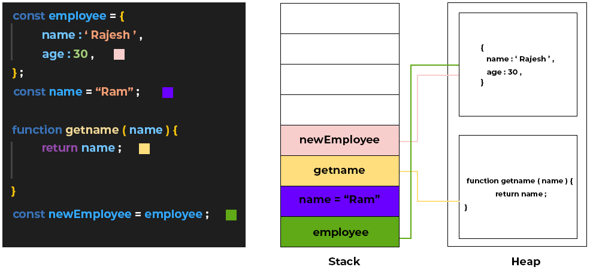
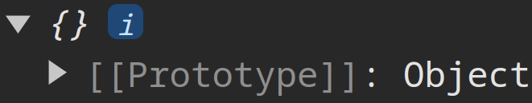
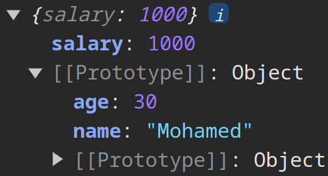
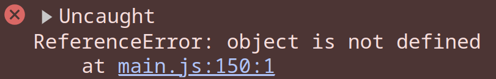

# Spread Operator

Spread operator is a new feature in ES6 that allows you to expand an iterable like an array or an object into individual elements. It is denoted by three dots `...` and can be used in a variety of ways.

## Spread in Arrays

The spread operator can be used to expand an array into individual elements. This is useful when you want to pass the elements of an array as arguments to a function.

::: {.columns .ragged columngap=1em column-rule="0.2pt solid black"}

```{.js .numberLines}
function sum (a, b, c) {
  return a + b + c;
}
const numbers = [1, 2, 3];
console.log(sum(...numbers)); // 6
```

\columnbreak

In this example if you didn't use the spread operator and passed the array directly to the `sum` function, the values of `a, b, c` would be `a = [1, 2, 3]`, `b = undefined`, `c = undefined`.

:::

You can also use the spread operator to combine arrays.

```{.js .numberLines}
const numbers1 = [1, 2, 3];
const numbers2 = [4, 5, 6];
const combined = [...numbers1, ...numbers2];
console.log(combined); // [1, 2, 3, 4, 5, 6]
```

## Spread in Objects

The spread operator can also be used to copy the properties of an object into a new object.

```{.js .numberLines}
const obj1 = {
  name: 'Mohamed',
  age: 30
};
const obj2 = {
  city: 'Cairo',
  country: 'Egypt'
};

const combined = { ...obj1, ...obj2 };
console.log(combined); // { name: 'Mohamed', age: 30, city: 'Cairo', country: 'Egypt' }
```

## Rest Parameter

The spread operator can also be used to collect multiple arguments into an array. This is called the rest parameter.

```{.js .numberLines}
function sum (...numbers) {
  let total = 0;
  for (let number of numbers) {
    total += number;
  }
  return total;
}

let numbers = [1, 2, 3, 4, 5];
console.log(sum(...numbers)); // 15
```

# Shallow Copy vs Deep Copy

To understand the difference between shallow copy and deep copy, let's first understand how JavaScript stores values in memory.

JavaScript uses two data structures to store values: the **stack** and the **heap**.

- The **stack** is used to store **primitive** values like numbers, strings, and booleans.
- The **heap** is used to store **non-primitive** values like objects, arrays, and functions.

When you assign a **primitive** value to a variable, the variable **stores the actual value**. When you assign a **non-primitive** value to a variable, the variable **stores a reference** to the value.

This image shows the difference between the stack and the heap:

{width=500px}

Notice that the primitive value `name` is stored directly in the stack, while other non-primitive values like `employee`, `newEmployee` objects, and `getName` function are stored in the heap and the stack stores a reference to them.

Also notice that since the statement `const newEmployee = employee;` is a shallow copy, both `employee` and `newEmployee` point to the same memory location in the heap.

## Shallow Copy

A shallow copy creates a new object that has just a reference to the values of the original object. This means that both objects point to the same memory location and share the same values in memory. So if you change something in the new object, the original object will also change and vice versa.

> We mean by object here both arrays and objects.

```{.js .numberLines}
let original = { name: "Mohamed", age: 30 };
let copied = original;

copied.age = 31;
console.log(original); // { name: "Mohamed", age: 31}
console.log(copied);   // { name: "Mohamed", age: 31}
```

## Deep Copy

A deep copy creates a new object that has a new memory location for each value of the original object. This means that both objects are completely independent of each other. So if you change something in the new object, the original object will not change.

### Rest Parameter in Deep Copy

You can use the rest parameter to create a deep copy of an object. This will create a new object with a copy of all **primitive** values.

Consider the following example:

::: {.columns .ragged}

Deep copy:

```{.js .numberLines}
const numbers = [1, 2, 3];
const copy = [...numbers];
numbers[0] = 100;
console.log(copy); // [1, 2, 3]
console.log(numbers); // [100, 2, 3]
```

\columnbreak

Shallow copy:

```{.js .numberLines}
const numbers = [1, 2, 3];
const copy = numbers;
numbers[0] = 100;
console.log(copy); // [100, 2, 3]
console.log(numbers); // [100, 2, 3]
```

:::

### Non-Primitive Values Inside Non-Primitive Values

If we have a non-primitive value inside another non-primitive value (like another object or an array), the spread operator will only create a shallow copy of the non-primitive value.

```{.js .numberLines}
const obj1 = { name: "Mohamed", address: { city: "Cairo" } };
const obj2 = { ...obj1 };

// Changing a primitive value
obj1.name = "Ali";
console.log(obj1); // { name: "Ali", address: { city: "Cairo" } }
console.log(obj2); // { name: "Mohamed", address: { city: "Cairo" } }

// Changing a non-primitive value
obj1.address.city = "Alex";
console.log(obj1); // { name: "Ali", address: { city: "Alex" } }
console.log(obj2); // { name: "Mohamed", address: { city: "Alex" } }
```

Notice that the primitive value `name` was a deep copy, while the non-primitive value `address` was a shallow copy.

### Deep Copy Using `JSON.parse` and `JSON.stringify`

To create a deep copy of an object that contains non-primitive values, you can use `JSON.parse` and `JSON.stringify`. This will create a new object with a copy of all values (both primitive and non-primitive).

This method works by converting the object to a string and then back to an object.

```{.js .numberLines}
const obj1 = { name: "Mohamed", address: { city: "Cairo" } };
const obj2 = JSON.parse(JSON.stringify(obj1));

obj1.address.city = "Alex";

console.log(obj1); // { name: "Mohamed", address: { city: "Alex" } }
console.log(obj2); // { name: "Mohamed", address: { city: "Cairo" } }
```

### Deep Copy Using `structuredClone`

Another way to create a deep copy of an object is to use the `structuredClone` method.

```{.js .numberLines}
const obj1 = { name: "Mohamed", address: { city: "Cairo" } };
const obj2 = structuredClone(obj1);

obj1.address.city = "Alex";

console.log(obj1); // { name: "Mohamed", address: { city: "Alex" } }
console.log(obj2); // { name: "Mohamed", address: { city: "Cairo" } }
```

# Higher-Order Functions

A higher-order function is a function that takes one or more functions as arguments or returns a function as its result.

Higher-order functions take anonymous functions or arrow functions as arguments and use them to perform some operation.

Examples of higher-order functions in JavaScript include:

- `forEach`
- `map`
- `filter`
- `reduce`
- `find`

## `forEach`

The `forEach` method is used to iterate over an array and execute a function for each element.

```{.js .numberLines}
const numbers = [1, 2, 3, 4, 5];

// Using anonymous function
numbers.forEach(function (number) {
  console.log(number);
});

// Using arrow function
numbers.forEach(number => console.log(number));
```

The code above is equivalent to the following:

```{.js .numberLines}
for (let number of numbers) {
  console.log(number);
}
```

Example of getting the sum of an array using `forEach`:

```{.js .numberLines}
const numbers = [1, 2, 3, 4, 5];
let sum = 0;

numbers.forEach(number => sum += number);

console.log(sum); // 15
```

Example using it with `getElementsByTagName`:

Suppose you have the following HTML:

```{.html .numberLines}
<ul>
  <li>Item 1</li>
  <li>Item 2</li>
  <li>Item 3</li>
</ul>
```

You can use `querySelectorAll` to select all the list items and then use `forEach` with `addEventListener` to add a click event to each item.

```{.js .numberLines}
const items = document.getElementsByTagName('li');

items.forEach(item => item.addEventListener('click', () => {
  console.log(item.textContent);
}));
```

If we use another parameter with `item` in the arrow function, it will be the index of the item in the array `(item, index) => ...`.

\begin{box4}{Note:}
The \texttt{forEach} works with NodeLists but not with HTMLCollections. If you want to use \texttt{forEach} with \texttt{getElementsByTagName}, you need to convert the HTMLCollection to an array first or just use \texttt{querySelectorAll} instead.
\end{box4}

## `map`

The `map` method is used to create a new array by applying a function to each element of an existing array. The new array will have the same length as the original array.

```{.js .numberLines}
let numbers = [1, 2, 3, 4, 5];
let doubled = numbers.map(number => number * 2);
console.log(doubled); // [2, 4, 6, 8, 10]
```

Notice that the original array `numbers` has not been modified.

Another Example with objects:

```{.js .numberLines}
let products = [
  { name: 'iPhone', price: 1000 },
  { name: 'iPad', price: 500 },
  { name: 'MacBook', price: 2000 }
];

let prices = products.map(product => {
  return `${product.name} Price is $${product.price}`;
});

console.log(prices); // ["iPhone Price is $1000", ....]
```

## `filter`

The `filter` method is used to create a new array with all elements that pass the test implemented by the provided function.

```{.js .numberLines}
let numbers = [1, 2, 3, 4, 5];
let even = numbers.filter(number => number % 2 === 0);
console.log(even); // [2, 4]
```

## `reduce`

The `reduce` method is used to reduce an array **to a single value**. It executes a reducer function on each element of the array, resulting in a single output value.

The reducer function takes four arguments:

1. Accumulator
2. Current Value
3. Current Index
4. Source Array

<!-- `reduce` is similar to `forEach`, but it returns a single value instead of an array. -->

```{.js .numberLines}
let numbers = [1, 2, 3, 4, 5];
let sum = numbers.reduce((acc, curr) => acc + curr, 0);
console.log(sum); // 15
```

Notice that the `reduce` method takes an initial value as the second argument. In this case, the initial value is `0`, if you don't provide an initial value, the first element of the array will be used as the initial value.

The reducer function which is `(acc, curr) => acc + curr` takes two arguments: `acc` which is the accumulator and `curr` which is the current value.

## `find`

The `find` method is used to return the first element in an array that satisfies a provided function. It returns `undefined` if no element satisfies the function.

It's similar to the `filter` method, but the difference is that `filter` returns an array of all elements that satisfy the function, while `find` returns only the first element that satisfies the function.

```{.js .numberLines}
let words = ['apple', 'banana', 'cherry'];
let found = words.find(word => word.length > 5);
console.log(found); // 'banana'
```

# Prototype

When you log an object in JavaScript, you may have noticed a property you didn't create called `[[Prototype]]`. This property is related to JavaScript's prototype-based inheritance system.

1. Every object in JavaScript has an internal property called `[[Prototype]]`.
2. This property is a reference to another object, which is the prototype of the current object.
3. The prototype object is used in the prototype chain, which is a mechanism for implementing inheritance in JavaScript.
4. When you try to access a property or method on an object, JavaScript first looks for it on the object itself. If it's not found, it looks up the prototype chain until it finds the property or reaches the end of the chain (usually `Object.prototype`).
   1. So if there is a property with the same name in the object and its prototype, the object's property will be used.

For example:

```{.js .numberLines}
let obj = {};
console.log(obj);
```

{width=250px}

The `[[Prototype]]` you see here is actually pointing to `Object.prototype`, which is the base prototype for all JavaScript objects.

## Prototypal Inheritance

Suppose you have the following objects:

```{.js .numberLines}
let person = {
  name: 'Mohamed',
  age: 30
};

let employee = {
  salary: 1000
};
```

If you want to make `employee` inherit the properties of `person`, you can set the prototype of `employee` to `person` using the `Object.setPrototypeOf` method.

Syntax of `Object.setPrototypeOf`: `Object.setPrototypeOf(object, prototype)`

```{.js .numberLines}
Object.setPrototypeOf(employee, person);
```

Now, `employee` will have access to the properties of `person`.

```{.js .numberLines}
console.log(employee.name); // 'Mohamed'
console.log(employee.age);  // 30
console.log(employee.salary); // 1000

console.log(employee);
```

{width=250px}

\begin{box4}{Important Notes:}

When using \texttt{Object.setPrototypeOf}, you can only set one prototype for an object, and if you set another prototype, it will override the previous one.

\tcbline

You can make a \textbf{chain of prototypes} by setting the prototype of an object to another object that has a prototype. The resulting object will have the properties of all the prototypes in the chain.
\\
\begin{Shaded}
\begin{Highlighting}[numbers=left,,]
\KeywordTok{let}\NormalTok{ person }\OperatorTok{=}\NormalTok{ \{ }\DataTypeTok{name}\OperatorTok{:} \StringTok{"Mohamed"}\NormalTok{ \}}\OperatorTok{;}
\KeywordTok{let}\NormalTok{ employee }\OperatorTok{=}\NormalTok{ \{ }\DataTypeTok{salary}\OperatorTok{:} \DecValTok{1000}\NormalTok{ \}}\OperatorTok{;}
\KeywordTok{let}\NormalTok{ manager }\OperatorTok{=}\NormalTok{ \{ }\DataTypeTok{department}\OperatorTok{:} \StringTok{"IT"}\NormalTok{ \}}\OperatorTok{;}

\BuiltInTok{Object}\OperatorTok{.}\FunctionTok{setPrototypeOf}\NormalTok{(employee}\OperatorTok{,}\NormalTok{ person)}\OperatorTok{;}
\BuiltInTok{Object}\OperatorTok{.}\FunctionTok{setPrototypeOf}\NormalTok{(manager}\OperatorTok{,}\NormalTok{ employee)}\OperatorTok{;}
\BuiltInTok{console}\OperatorTok{.}\FunctionTok{log}\NormalTok{(manager}\OperatorTok{.}\AttributeTok{name}\NormalTok{)}\OperatorTok{;} \CommentTok{// Mohamed}
\BuiltInTok{console}\OperatorTok{.}\FunctionTok{log}\NormalTok{(manager}\OperatorTok{.}\AttributeTok{salary}\NormalTok{)}\OperatorTok{;} \CommentTok{// 1000}
\BuiltInTok{console}\OperatorTok{.}\FunctionTok{log}\NormalTok{(manager}\OperatorTok{.}\AttributeTok{department}\NormalTok{)}\OperatorTok{;} \CommentTok{// IT}
\end{Highlighting}
\end{Shaded}

\tcbline

Another important thing to note is that you can't set two objects as
prototypes for each other because it will create a circular reference.
\\
\begin{Shaded}
\begin{Highlighting}[numbers=left,,]
\KeywordTok{let}\NormalTok{ person }\OperatorTok{=}\NormalTok{ \{ }\DataTypeTok{name}\OperatorTok{:} \StringTok{\textquotesingle{}Mohamed\textquotesingle{}}\NormalTok{ \}}\OperatorTok{;}
\KeywordTok{let}\NormalTok{ employee }\OperatorTok{=}\NormalTok{ \{ }\DataTypeTok{salary}\OperatorTok{:} \DecValTok{1000}\NormalTok{ \}}\OperatorTok{;}

\BuiltInTok{Object}\OperatorTok{.}\FunctionTok{setPrototypeOf}\NormalTok{(employee}\OperatorTok{,}\NormalTok{ person)}\OperatorTok{;}
\BuiltInTok{Object}\OperatorTok{.}\FunctionTok{setPrototypeOf}\NormalTok{(person}\OperatorTok{,}\NormalTok{ employee)}\OperatorTok{;}
\end{Highlighting}
\end{Shaded}

\begin{figure}
\centering
\includegraphics[width=4.16667in,height=\textheight]{image/circular-ref.png}
\caption{Circular Refference Error}
\end{figure}

\end{box4}

## `Object`

When you create an array in JavaScript, it inherits from `[[Prototype]]` by default.

The `[[Prototype]]` gives the array access to all the methods and properties of the `Array` object.

You can override the prototype of an array object making functions like `push`, `pop`, etc. unavailable.

```{.js .numberLines}
let arr = [];
let obj = {};

object.setPrototypeOf(arr, obj);
arr.push(1); // TypeError: arr.push is not a function
```

{width=300px}

The same happens with strings, numbers, and booleans. They all have a prototype that gives them access to methods and properties.

\pagebreak

# Summary

- The spread operator `...` is used to expand an iterable like an array or an object into individual elements.
- The spread operator can be used to pass the elements of an array as arguments to a function or to combine arrays.
- The spread operator can also be used to copy the properties of an object into a new object.
- The rest parameter is used to collect multiple arguments into an array.
- A shallow copy creates a new object that has just a reference to the values of the original object, while a deep copy creates a new object with a new memory location for each value of the original object.
- You can use `JSON.parse` and `JSON.stringify` to create a deep copy of an object that contains non-primitive values.
- You can use the `structuredClone` method to create a deep copy of an object.
- Higher-order functions are functions that take one or more functions as arguments or return a function as their result.
- Examples of higher-order functions in JavaScript include `forEach`, `map`, `filter`, `reduce`, and `find`.
  - The `forEach` method is used to iterate over an array and execute a function for each element.
  - The `map` method is used to create a new array by applying a function to each element of an existing array.
  - The `filter` method is used to create a new array with all elements that pass the test implemented by the provided function.
  - The `reduce` method is used to reduce an array to a single value.
  - The `find` method is used to return the first element in an array that satisfies a provided function.
- Every object in JavaScript has an internal property called `[[Prototype]]`, which is a reference to another object that is the prototype of the current object.
- The prototype object is used in the prototype chain, which is a mechanism for implementing inheritance in JavaScript.
- You can use `Object.setPrototypeOf` to set the prototype of an object to another object.
- You can create a chain of prototypes by setting the prototype of an object to another object that has a prototype.
- You can't set two objects as prototypes for each other because it will create a circular reference.
- When you create an array in JavaScript, it inherits from `[[Prototype]]` by default, giving it access to all the methods and properties of the `Array` object.
