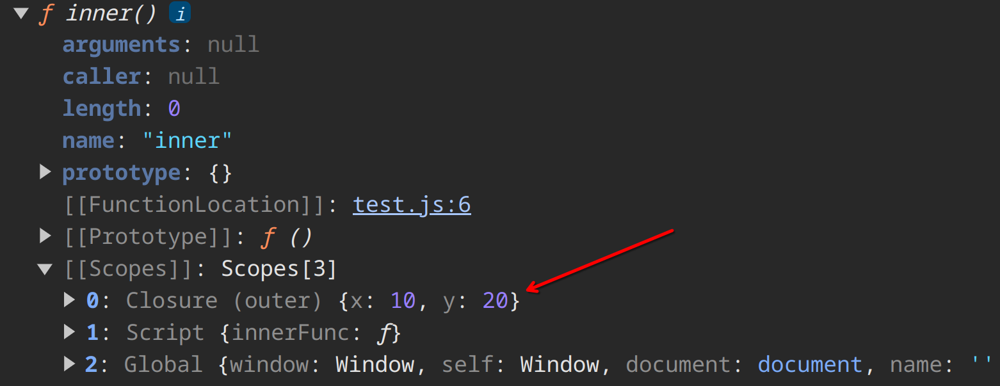

# Example Website

Watch OSAKA example website videos on google drive.

# Some Notes

- When you are inside an event function, instead of using `e.target` we can use `this` which will also show the HTML code of the target element.
- To get the distance from the top of a section to the top of the page you can use `$("selector").offset().top`.
  - It also has a `left` property `$("selector").offset().left` which gives the distance from the left side of the page.
- To get the height of an element you can use `$("selector").height()`.
- `$("selector").scrollTop()` will give you the distance from the top of the page to the top of the section. `$(window).scrollTop(0)` can be used in a button click event to scroll to the top of the page.

```{.js .numberLines}
$('html,body').animate({
  scrollTop:0
  },4000)
```

- The code above will scroll to the top of the page in 4 seconds.
- `$(window).scroll()` is an event that is triggered when the user scrolls the page.
- `$(window).scrollTop()` will give you the distance from the top of the page to the top of the window.
- To do something when the page loads for example hide the spinner you can use `$(window).ready(() => $('#loading).slideUp(1000))`.

# Packge Manager (npm)

npm stands for Node Package Manager. It is used to install packages that are needed for a project, instead of manually downloading them. It is also used to manage the versions of the packages.

To have the npm command available in the terminal you need to install [Node.js](https://nodejs.org/en/).

To install a package you can use `npm install package-name`. This will download the package and save it in a folder called `node_modules`. It will also create a file called `package.json` which will contain the name of each package and its version.

To install a specific version of a package you can use `npm install package-name@version`.

After installing the packages you can link them to your project.

# Closure

In JavaScript, a closure is a function that has access to its own scope and the scope of its parent functions, even when the parent functions have returned. This allows the function to "remember" and use variables from its parent scope, even when it's called outside of that scope.

```{.js .numberLines}
function outer() {
  let x = 10;
  let y = 20;
  let z = 30;

  function inner() {
    console.log(x, y);
  }

  return inner;
}

const innerFunc = outer();
innerFunc(); // logs 10
```

If you want to see closure in the console you can use `console.dir(innerFunc)`.

{width=70%}

Notice that it has only access to the variables `x` and `y` and not `z` because it is not used in the inner function.
