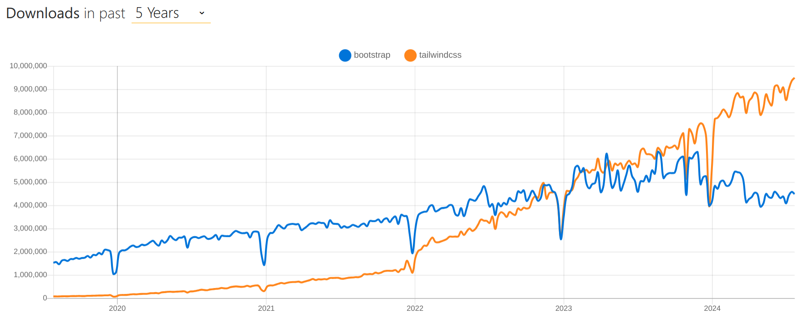

# NPM Continued

When we upload our project to a server, we use a bundler to bundle all HTML files into one file, all CSS files into one file, and all JS files into one file. This is done to reduce the number of requests made to the server. Example bundler is Webpack.

Some libraries and files are used only while developing the project and are not used in the production environment.

Example files include `.ts` files, `.scss` since browsers understand `.css` not `.scss`, and `.js` not `.ts`.

These libraries are called `devDependencies`. They are not included in the production environment. When installing these libraries via npm, we use the `-D` flag to install them as devDependencies. Example `npm i -D tailwindcss`.

# Tailwind CSS

<!-- 
The notes here considers that you have already know bootstrap CSS, and just tries to cover the new things in Tailwind CSS. 

It's always better to use Tailwind documentation to get more details about the classes and how to use them. 
-->

Tailwind CSS is a utility-first CSS framework. It was introduced in 2017. Tailwind allows us to build custom designs without the need to write any CSS. With tailwind you are not limited to the set of predefined classes by the framework. You can create your own custom classes.

Tailwind also has a paid version called Tailwind UI. Tailwind UI provides pre-built components that can be used in your project.

In the last couple of years, Tailwind has more gained popularity than Bootstrap as you can see here in [npm trends](https://www.npmtrends.com/bootstrap-vs-tailwindcss):

{width=600px}

One of the best things about Tailwind is that it has better performance than other CSS frameworks like Bootstrap. Tailwind only includes the CSS that is used in the project. This reduces the size of the CSS file. (This is also the reason why using tailwind via CDN is not the best option for production environment as it includes all the CSS classes).

Tailwind has an `input.css` file that includes all the classes. This file is then processed to generate the final `output.css` file. This final CSS file is then included in the project.

In browser you can see the performance of your site in light house tab.

As mentioned [in documentation](https://tailwindcss.com/docs/installation), To install Tailwind via CLI:

1. We run `npm i -D tailwindcss`
2. Run `npx tailwindcss init` to create a `tailwind.config.js` file.
3. Add `content: ["./src/**/*.{html,js}"],` to the `tailwind.config.js` file.
4. Create a dir `src` and add an `input.css` file.
5. Add the following code to the `input.css` file:

```{.css .numberLines}
@tailwind base;
@tailwind components;
@tailwind utilities;
```

6. Run `npx tailwindcss -i ./src/input.css -o ./dist/output.css --watch`
7. Link your HTML file with `output.css` file.

**Some Notes:**

1. After running `npx tailwindcss -i ./src/input.css -o ./dist/output.css --watch` you will notice that the file `output.css` has some CSS code, this code represents the `@tailwind base;` which is used for CSS normalization.
2. The `--watch` flag is used to watch for changes in the files in `content` array in `tailwind.config.js` file. If any changes are made, the `output.css` file is updated automatically. So for example, if you add a new class in the `index.html` file, the `output.css` file will have the new class added automatically. It also saves you time from running the command again and again.
3. The `content: ["./src/**/*.{html,js}"]` means that Tailwind will look for classes in all the HTML and JS files in the `src` directory.
   1. `*` matches any thing except slashes and hidden files.
   2. `**` matches zero or more directories.
   3. The `./src/**/*.{html,js}` is a content pattern that you should be specific about. If you are not specific, you might end up with a lot of classes that are not used in your project.

# Tailwind Colors

Tailwind has a large set of colors that can be used in your project. You can find the list of colors in the [documentation](https://tailwindcss.com/docs/customizing-colors).

You can also create your own custom colors to use with the background for example, by using `bg-[customColor]` for example `bg-[#ff0000]`. This doesn't only apply to background colors, you can also use it for text colors, border colors, etc.

The class `bg-[#ff0000]` is translated in the `output.css` file to:

```{.css .numberLines}
.bg-\[\#ff0000\] {
  --tw-bg-opacity: 1;
  background-color: rgb(255 0 0 / var(--tw-bg-opacity));
}
```

You can also define the colors in the `tailwind.config.js` file. For example:

```{.js .numberLines}
module.exports = {
  theme: {
    colors: {
      'blue': '#1fb6ff',
      'purple': '#7e5bef',
      'pink': '#ff49db',
      'orange': '#ff7849',
      'green': '#13ce66',
      'yellow': '#ffc82c',
      'gray-dark': '#273444',
      'gray': '#8492a6',
      'gray-light': '#d3dce6',
    },          
  }
}
```

That will override the default colors in Tailwind. So now you can use `bg-blue`, `bg-purple`, etc, but you can't use the default colors like `bg-red-300`, `bg-green-400`, etc.

So to have those custom colors in addition to the default colors, you can add them to the `extend` object:

```{.js .numberLines}
module.exports = {
  theme: {
    extend: {
      colors: {
        'blue': '#1fb6ff',
        'purple': '#7e5bef',
        'pink': '#ff49db',
        'orange': '#ff7849',
        'green': '#13ce66',
        'yellow': '#ffc82c',
        'gray-dark': '#273444',
        'gray': '#8492a6',
        'gray-light': '#d3dce6',
      },
    },
  }
}
```

Now you can use both the default colors and the custom colors.

# Tailwind Spacing

  If you don't
You can define custom spacing using `p-[customSpacing]` for padding, `m-[customSpacing]` for margin, `w-[customSpacing]` for width, `h-[customSpacing]` for height, etc. For example, `p-[40rem]` will add a padding of 40rem.

This `p-[40rem]` class is translated in the `output.css` file to:

```{.css .numberLines}
.p-\[40rem\] {
  padding: 40rem;
}
```

You can also define that custom spacing in the`tailwind.config.js` file:

```{.js .numberLines}
module.exports = {
  theme: {
    extend: {
      spacing: {
        '100': '100px',
      },
    },
  }
}
```

Now you can use `p-100`, `mt-100`, `mb-100`, `ml-100`, `mr-100`, etc.

That `p-100` class is translated in the `output.css` file to:

```{.css .numberLines}
.p-100 {
  padding: 100px;
}
```

Notice that adding `spacing` in the `theme` object will override the default spacing in Tailwind.

## Spacing Between Elements

- `space-x-Number` is used to add spacing between elements in the x-axis. It can be used with flexbox classes like `flex-row`.
- `space-y-Number` is used to add spacing between elements in the y-axis. It can be used with flexbox classes like `flex-col`.
- `space-x-reverse` should be used if you have `flex-row-reverse` or `flex-col-reverse` to reverse the spacing in the x-axis.

The space classes start applying spaces from the second element, that is because they have the selector `space-x-.... > * + *` which means apply the margin to the second element and the rest of the elements.

## Width and Height

### Width

- `w-WIDTH` is used to set the width of an element. For example, `w-[100px]` will set the width to 100px.
- `w-1/2` is used to set the width to 50%.
- `w-1/3` is used to set the width to 33.333333%. and so on.

There are many default width and height classes you can check in the [documentation](https://tailwindcss.com/docs/width).

### Height

- `h-HEIGHT` is used to set the height of an element. For example, `h-[100px]` will set the height to 100px.
- `h-1/2` is used to set the height to 50%.
- `h-1/3` is used to set the height to 33.333333%. and so on.

There are many default width and height classes you can check in the [documentation](https://tailwindcss.com/docs/height).

## Size

- `size-SIZE` is used to set the width and height of an element. For example, `size-[100px]` will set the width and height to 100px.
- `size-1/2` is used to set the width and height to 50%.
- `size-1/3` is used to set the width and height to 33.333333%. and so on.

## Hover, Focus, and Active

- `hover:bg-COLOR` is used to change the background color of an element when hovered.
  - You can also specify the duration of the hover effect by using `duration-TIME`
  - You can also add delay to the hover effect by using `delay-TIME`
- `focus:bg-COLOR` is used to change the background color of an element when focused.

## Valid and Invalid

Those two classes are used to style input fields based on whether the input is valid or invalid.

- `valid:bg-green-100` is used to style the input field when the input is valid.
- `invalid:bg-red-100` is used to style the input field when the input is invalid.

## Required & Disabled

- `required:bg-red-100` is used to style the input field when it is required.
- `disabled:bg-gray-100` is used to style the input field when it is disabled.

## First & Last Child

- `first:bg-COLOR` is used to give a background to the first child of an element.
- `last:bg-COLOR` is used to give a background to the last child of an element.

## Even & Odd

- `even:bg-COLOR` is used to give a background to the even children of an element.
- `odd:bg-COLOR` is used to give a background to the odd children of an element.

## Hovering on Parent Affected Child

- `group` is used to group the parent and the child elements.
- `group-hover:bg-COLOR` is used to change the background color of the child element when the parent element is hovered.

```{.html .numberLines}
<div class="group p-4 bg-red-400">
  <div class="bg-green-300 group-hover:bg-yellow-300">Child</div>
</div>
```

## Peer

- `peer` is used to style the sibling elements.
- `peer-hover:bg-COLOR` is used to change the background color of the sibling element when hovered.

```{.html .numberLines}
<div class="peer bg-red-400">Sibling 1</div>
<div class="peer-hover:bg-green-300">Sibling 2</div>
```

Here if you hover on the first sibling, the second sibling will change its background color.

## Container

This part is important for responsive design. Better to read it in the [documentation](https://tailwindcss.com/docs/container).

## Background

See the Background part in [documentation](https://tailwindcss.com/docs/background-color)
