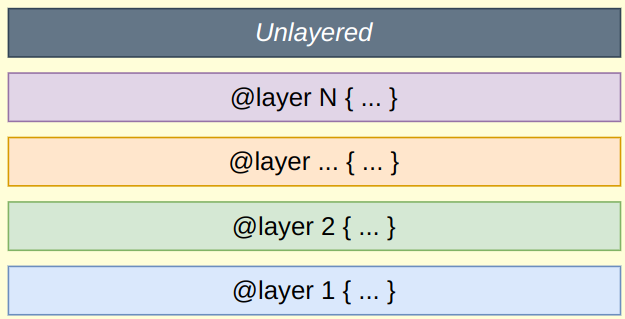
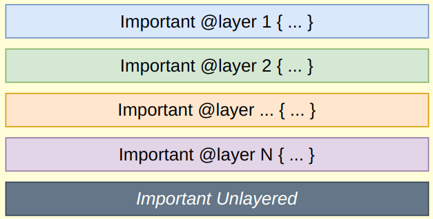

# CSS Layers

Layers is a new CSS concept that was introduced in 2022. It is used to declare a cascade layer and can also be used to define the order of precedence in case of multiple cascade layers.

We can define a layer by using the `@layer` directive. The `@layer` directive can be used to define a layer at the top of the CSS file. We can define multiple layers in a CSS file.

Consider this example:

```{.html .numberLines}
<button class="btn" id="my_btn">Click</button>
```

In CSS:

```{.css .numberLines}
@layer one {
  #my_btn {
    background-color: blue;
  }
}

@layer two {
  .btn {
    background-color: red
  }
}
```

In the above example, we have defined two layers, `one` and `two`. The `.btn` class in the `two` layer will override the `#btn` class in the `one` layer.

When using layers we don't care about specificity, we only care about the order of the layers. The layer that is defined later will override the properties of the layer that is defined earlier. That is why the `.btn` class will override the `#btn` class in the above example.

In the example before we used the order in which the layers were written in our code. But we can also define the order of the all the layers in the CSS file like this:

```{.css .numberLines}
@layer one, two, three;
```

Here we are defining the order of the layers. The `three` layer will have the highest precedence and the `one` layer will have the lowest precedence. So even if you write the `three` layer first in the CSS file, and the `one` layer last, the `three` layer will still have the highest precedence because we have defined the order of the layers.

```{.css .numberLines}
@layer three {
  button {
    background-color: green;
  }
}

@layer one {
  #my_btn {
    background-color: blue
  }
}

@layer two {
  .btn {
    background-color: red;
  }
}
```

In the above example, the `three` layer will have the highest precedence and will override the styles of the `one` and `two` layers.

---

But what if we have a CSS rule that is not defined in any layer? In that case, in that case that rule will override all the layers. So, if we have a rule that is not defined in any layer, it will have the highest precedence. It's like that rule is in a layer that is defined after all the layers.

```{.css .numberLines}
button{
  background-color: yellow;
}

@layer three {
  #my_btn {
    background-color: blue;
  }
}
```

In the above example, the `button` rule will override all the layers because it is not defined in any layer.

## Layer & `!important`

In layers, `!important` works the opposite way. The first layer that has the `!important` rule will have the highest precedence. So, if we have a rule with `!important` in the `one` layer and a rule with `!important` in the `two` layer, the rule in the `one` layer will have the highest precedence.

```{.css .numberLines}
@layer one, two, three;

@layer three {
  button {
    background-color: green !important;
  }
}

@layer one {
  button {
    background-color: blue !important;
  }
}

@layer two {
  button {
    background-color: red !important;
  }
}

button {
  background-color: yellow !important;
}
```

In the above example, the `button` rule in the `one` layer will have the highest precedence because it has the `!important` rule.

See these two images for a better understanding:

{width=220px}

{width=220px}

Layers concept is used with tailwind CSS and that is what we will talk about next.

# Layers in Tailwind CSS

When you start using Tailwind CSS, you will need to add those three lines at the beginning of your CSS file:

```{.css .numberLines}
@tailwind base;
@tailwind components;
@tailwind utilities;
```

Those three lines are the layers in Tailwind CSS. The `base` layer contains the base styles, the `components` layer contains the components styles, and the `utilities` layer contains the utility classes.

The same rules apply to the layers in Tailwind CSS. The `base` layer has the lowest precedence, the `components` layer has the middle precedence, and the `utilities` layer has the highest precedence. That is why when you define a utility class, it will override the components and base styles.

You can also add styles to existing layers or create new layers in Tailwind CSS. You can do that by using the `@layer` directive.

```{.css .numberLines}
@tailwind base;
@tailwind components;
@tailwind utilities;

@layer base {
  button {
    background-color: blue;
  }
}
```

In the above example, we have added a new style to the `base` layer, so any button in the HTML file will have a blue background color unless it is overridden by a utility class. You can do the same width the `components` and `utilities` layers.

Now you can make your own new utility classes and add them to the `utilities` layer.

```{.css .numberLines}
@layer utilities {
  .btn-warning {
    background-color: orange;
  }
}
```

## `@apply` Directive

Not only that **you can also use Tailwind classes inside the `@layer` directive** using `@apply` directive.

```{.css .numberLines}
@layer utilities {
  .btn-warning {
    @apply bg-orange-500 text-white rounded-md px-4 py-2;
  }
}
```

Now using `btn-warning` will be equivalent to using `bg-orange-500 text-white rounded-md px-4 py-2`.

# `@config` Directive

You can also use the `@config` directive to change the configuration of Tailwind CSS. This is useful if you have a large project and you want to apply different configurations to different users or different parts of the project.

For example this applies a configuration file for main site:

```{.css .numberLines}
@config "./tailwind.site.config.js";

@tailwind base;
@tailwind components;
@tailwind utilities;
```

And this for admins:

```{.css .numberLines}
@config "./tailwind.admin.config.js";

@import "tailwindcss/base";
@import "tailwindcss/components";
@import "tailwindcss/utilities";
```

# `theme()`, `screens()` Functions

`theme()` is a function that allows you to access the theme configuration values in Tailwind CSS configuration file. You can use it to access the colors, fonts, spacing, and other configurations values in the theme.

# Responsive Tailwind Example

```{.html .numberLines}
<div class="flex flex-wrap">
  <div
    class="shadow-lg p-3 md:w-6/12 md:bg-red-300 md:font-mono lg:w-4/12">
    <p>Lorem, ipsum dolor.</p>
  </div>
  <div
    class="shadow-lg p-3 md:w-6/12 md:bg-red-300 md:font-mono lg:w-4/12">
    <p>Lorem, ipsum dolor.</p>
  </div>
  <div
    class="shadow-lg p-3 md:w-6/12 md:bg-red-300 md:font-mono lg:w-4/12">
    <p>Lorem, ipsum dolor.</p>
  </div>
  <div
    class="shadow-lg p-3 md:w-6/12 md:bg-red-300 md:font-mono lg:w-4/12">
    <p>Lorem, ipsum dolor.</p>
  </div>
</div>
```

In the example above we have a responsive layout. The `md` prefix means that the style will be applied on medium screens and larger. The `lg` prefix means that the style will be applied on large screens and larger. `md:w-6/12` means that the width of the element will be 50% on medium screens and larger. `md:bg-red-300` means that the background color of the element will be red on medium screens and larger. `md:font-mono` means that the font of the element will be monospace on medium screens and larger.

`lg:w-4/12` means that the width of the element will be 33.33% on large screens and larger.

You can add custom screen sizes to tailwind to the existing ones like `sm`, `md`, `lg`, `xl` by using `screens` in the configuration file.

```{.js .numberLines}
/** @type {import('tailwindcss').Config} */
/** @type {import('tailwindcss').Config} */
module.exports = {
  theme: {
    extend: {
      screens: {
      'tablet': '640px',
      // => @media (min-width: 640px) { ... }

      'laptop': '1024px',
      // => @media (min-width: 1024px) { ... }

      'desktop': '1280px',
      // => @media (min-width: 1280px) { ... }
    },
    }
  }
}
```

So now you can use `tablet`, `laptop`, and `desktop` as screen sizes in your CSS in addition to the existing ones.

---

You can also use arbitrary values:

```{.html .numberLines}
<div class="min-[320px]:text-center max-[600px]:bg-sky-300">
  <!-- ... -->
</div>
```

In the example above, the text will be centered if the screen width is at 320px or more and the background color will be sky-300 if the screen width is 600px or less.

If you have the Tailwind VSCode extension installed, you will see the CSS values of these classes if you hover over them.

# Dark Mode

To use darkmode in tailwind you need to specify `darkMode: 'class'` in the configuration file.

```{.js .numberLines}
/** @type {import('tailwindcss').Config} */
module.exports = {
  darkMode: 'class',
  // ...
}
```

Now if you add `dark` class to the `html` element, the dark mode will be activated.

```{.html .numberLines}
<html class="dark">
```

To add dark mode styles, you can use the `dark:` prefix.

```{.html .numberLines}
<div class="bg-white dark:bg-gray-800">
  <!-- ... -->
</div>
```

In the example above, the background color will be white in light mode and `gray-800` in dark mode.

You can use a toggle button to switch between light and dark mode, and add even listeners in JavaScript to toggle the `dark` class on the `html` element.

```{.html .numberLines}
<input type="checkbox" name="light-switch" class="light-switch" />
```

```{.js .numberLines}
const lightSwitch = document.querySelector('.light-switch');

lightSwitch.addEventListener('change', () => {
  document.documentElement.classList.toggle('dark');
});
```

# Tailwind Plugins

You can add plugins to Tailwind CSS to extend its functionality. You can add plugins to add new utilities, components, or styles.

Tailwind has some official plugins that you can use. You can find them [here](https://tailwindcss.com/docs/plugins).

Example using `@tailwindcss/typography` plugin:

First install the plugin via npm: `npm install -D @tailwindcss/typography`

Then add `require('@tailwindcss/typography'` to the plugins array in the configuration file.

```{.js .numberLines}
/** @type {import('tailwindcss').Config} */
module.exports = {
  plugins: [
    require('@tailwindcss/typography')
  ],
  // ...
}
```

Now you can use the typography plugin in your CSS.

```{.html .numberLines}
<article class="prose lg:prose-xl">
  <h1>Garlic bread with cheese: What the science tells us</h1>
  <p>
    For years parents have espoused the health benefits of eating garlic bread with cheese to their
    children, with the food earning such an iconic status in our culture that kids will often dress
    up as warm, cheesy loaf for Halloween.
  </p>
  <p>
    But a recent study shows that the celebrated appetizer may be linked to a series of rabies cases
    springing up around the country.
  </p>
  <!-- ... -->
</article>
```

In the example above, we are using the `prose` class from the typography plugin to style the text.

To know how to use each plugin check its README file on GitHub.

# Some Tailwind Utilities

We have some classes related font-family like:

- `font-sans`
- `font-serif`
- `font-mono`

We have some classes related to font-size like:

- `text-xs`
- `text-sm`
- `text-base`
- `text-lg`
- `text-xl`

And more. See the [documentation](https://tailwindcss.com/docs/font-size) for more information.

We have font-style classes like:

- `italic`
- `not-italic`

We have font-weight classes like:

- `font-thin`
- `font-light`
- `font-normal`
- `font-medium`
- `font-semibold`
- `font-bold`
- `font-extrabold`
- `font-black`

We have line-clamp which will truncate the text after a certain number of lines:

- `line-clamp-1`
- `line-clamp-2`
- `line-clamp-3`

And more. See the [documentation](https://tailwindcss.com/docs/line-clamp) for more information.

We have `bg-[url('./path/to/img')]` to set the background image of an element, **But Notice that the path is relative to the output CSS file not the HTML file**.

You can also define a custom image in the configuration file:

```{.js .numberLines}
/** @type {import('tailwindcss').Config} */
module.exports = {
  theme: {
    extend: {
      backgroundImage: {
        'main': "url('./path/to/img')" // Path is relative to CSS file too
      }
    }
  }
}
```

And then use it like this:

```{.html .numberLines}
<div class="bg-main">
  <!-- ... -->
</div>
```

To change the opacity of the background image you can use `bg-color/[opacity]`, for example `bg-green-600/20` will set the background color to green-600 with an opacity of 20%.

We also have divide utilities to add dividers between elements, the dividers are borders:

- `divide-x`
- `divide-y`
- `divide-x-reverse`
- `divide-y-reverse`

Divide work similar to space utilities, you can use `divide-[width]` to set the width of the divider and `divide-[color]` to set the color of the divider.

We have also mix blend modes, which are used to blend the element with the background: See the [documentation](https://tailwindcss.com/docs/mix-blend-mode) for more information.

We also have transition utilities you can see the [documentation](https://tailwindcss.com/docs/transition-property) for more information.

We also have transform utilities you can see the [documentation](https://tailwindcss.com/docs/transform) for more information.

We also have animation utilities you can see the [documentation](https://tailwindcss.com/docs/animation) for more information.

